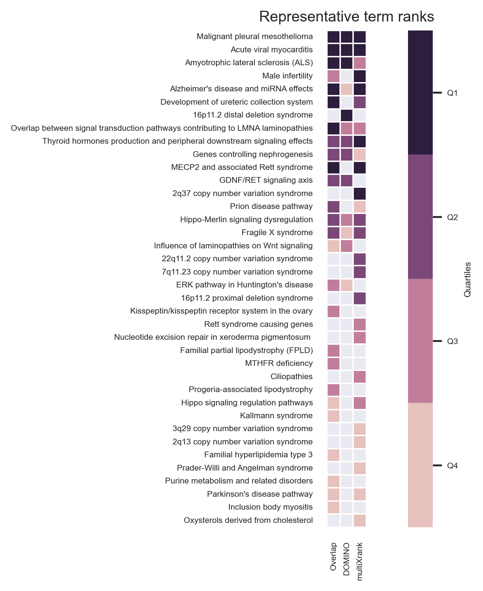

.. _example1:

==================================================
Example 1 : data are extracted with requests
==================================================

Study the link between vitamin A and rare diseases
Request directly CTD database and WikiPathways.
User gives only the MeSH ID of Vitamin A to the script and can perform three different methods.

Overlap analysis
===================

The InputFile_factorsList.csv file contains the MeSH ID of vitamin A. We want to find target of vitamin A and of its descendant molecules.
So, the ``--directAssociation`` parameter is set to ``False``.
Only the interaction between vitamin A (and related molecules) and genes with at least two publications are kept (``--nbPub 2``).
Results files are saved into ``examples/OutputResults_example1/`` folder.

.. code-block:: bash

   python3 main.py overlap  --factorList examples/InputData/InputFile_factorsList.csv \
                            --directAssociation FALSE \
                            --nbPub 2 \
                            --outputPath examples/OutputResults_example1/

Several files are generated :

- ``CTD_request_D014801_2022_08_11.tsv`` and ``CTD_requestFiltered_D014801_2022_08_11.tsv`` :
  the first file contains results from CTD request and the second one contains the filtered (by paper number) results.

- ``WP_RareDiseases_request_2022_08_11.gmt`` and ``WP_allPathways_request_2022_08_11.gmt`` :
  the first file contains all the **human rare diseases pathways** from WikiPathways request
  and the second file contains all the **human pathways** which are in WikiPathways.

- ``Overlap_D014801_withRDWP.csv`` : results of the overlap analysis between targeted genes and rare diseases pathways

If you want to have more details about theses files go to : **BLABLABLA**

Results

*request on the 11th of August 2022*

Request :
- 10 molecules (vitamin A + 9 descendants)
- 7 766 genes linked

Filtered request :
- 7 molecules (vitamin A + 6 others)
- 2 143 genes linked

- 102 rare diseases pathways (between 2 and 436 genes)
- 1 261 human pathways (between 1 and 484 genes)

- target genes overlap significantly 27 RD pathways
- 1726 genes are found (and used) in the WikiPathways background

Top 5 :

+------------+----------------------------------------------------+---------------+------------------+
| PathwayIDs | PathwayNames                                       | pAdjusted     | IntersectionSize |
+============+====================================================+===============+==================+
|   WP5087   | Malignant pleural mesothelioma                     | 3.663e-24     |       146        |
+------------+----------------------------------------------------+---------------+------------------+
|   WP4298   | Acute viral myocarditis                            | 9.183e-16     |        45        |
+------------+----------------------------------------------------+---------------+------------------+
|   WP2447   | Amyotrophic lateral sclerosis (ALS)                | 1.020e-11     |        25        |
+------------+----------------------------------------------------+---------------+------------------+
| **WP5053** | **Development of ureteric collection system**      | **2.557e-08** |      **28**      |
+------------+----------------------------------------------------+---------------+------------------+
|   WP4879   | Overlap between signal transduction pathways ...   | 7.638e-07     |        25        |
+------------+----------------------------------------------------+---------------+------------------+

On a previous analysis (Ozisik *et al.*, 2022), an overlap analysis was made between genes targeted by vitamin A and
CAKUT pathways. Three of the four pathways related to CAKUT overlaping target genes are found in this analysis :

+------------+----------------------------------------------------+-----------+------------------+
| PathwayIDs | PathwayNames                                       | pAdjusted | IntersectionSize |
+============+====================================================+===========+==================+
|   WP5053   | Development of ureteric collection system          | 2.557e-08 |        28        |
+------------+----------------------------------------------------+-----------+------------------+
|   WP4830   | GDNF/RET signaling axis                            | 1.95e-05  |        13        |
+------------+----------------------------------------------------+-----------+------------------+
|   WP4823   | Genes controlling nephrogenesis                    | 8.55e-05  |        18        |
+------------+----------------------------------------------------+-----------+------------------+

Active Module Identification
==================================

.. warning::

   Results of DOMINO can't be reproduced when using their server.

As before, we want to extract target genes of vitamin A and its related molecules with at least two references about this link
(`--directAssociation False`` and ``--nbPub 2``).
With this method, we will search active modules (extend our target list to other link genes) using a protein-protein
interaction network (``PPI_network_2016.sif``). Then, for each active module identified, an overlap analysis will made
against the rare disease pathways from WikiPathways.
Results files are saved into ``examples/OutputResults_example1/`` folder.

.. code-block:: bash

    python3 main.py domino  --factorList examples/InputData/InputFile_factorsList.csv \
                            --directAssociation FALSE \
                            --nbPub 2 \
                            --networkFile examples/InputData/PPI_network_2016.sif \
                            --outputPath examples/OutputResults_example1/

Several files are generated :

- ``CTD_request_D014801_2022_08_11.tsv`` and ``CTD_requestFiltered_D014801_2022_08_11.tsv`` :
  the first file contains results from CTD request and the second one contains the filtered (by paper number) results.

- ``WP_RareDiseases_request_2022_08_11.gmt`` and ``WP_allPathways_request_2022_08_11.gmt`` :
  the first file contains all the **human rare diseases pathways** from WikiPathways request
  and the second file contains all the **human pathways** which are in WikiPathways.

- ``DOMINO_inputGeneList_D014801.txt`` : list of genes used for the AM identification

- ``Overlap_AM_*_D014801_withRDWP.csv`` : results of the overlap analysis between targeted genes and rare diseases pathways.
  One file for each AM.

- ``DOMINO_D014801_activeModulesNetwork.txt``, ``DOMINO_D014801_overlapAMresults4Cytoscape.txt``, ``DOMINO_D014801_activeModules.txt``
  , ``DOMINO_D014801_activeModulesNetworkMetrics.txt`` and ``DOMINO_D014801_signOverlap.txt`` : some metrics are
  calculated and saved into files. Theses files are useful for visualisation.

If you want to have more details about theses files go to : **BLABLABLA**

Results :

Request :

- 10 molecules (vitamin A + 9 descendants)
- 7 766 genes linked

Filtered request :

- 7 molecules (vitamin A + 6 others)
- 2 143 genes linked

- 102 rare diseases pathways (between 2 and 436 genes)
- 1 261 human pathways (between 1 and 484 genes)

- 2 143 genes inside the DOMINO input genes list
- 13 Active modules (between 93 and 28 nodes) (see ``DOMINO_D014801_activeModulesNetworkMetrics.txt`` file)

- 6 Active modules overlap significantly genes list

There are the significant results :

+----------+---------------------------------------------------------------------------------+
| termID   | termTitle                                                                       |
+==========+=================================================================================+
| WP2059   | Alzheimer's disease and miRNA effects                                           |
+----------+---------------------------------------------------------------------------------+
| WP2447   | Amyotrophic lateral sclerosis (ALS)                                             |
+----------+---------------------------------------------------------------------------------+
| WP3853   | ERK pathway in Huntington's disease                                             |
+----------+---------------------------------------------------------------------------------+
| WP4298   | Acute viral myocarditis                                                         |
+----------+---------------------------------------------------------------------------------+
| WP4541   | Hippo-Merlin signaling dysregulation                                            |
+----------+---------------------------------------------------------------------------------+
| WP4549   | Fragile X syndrome                                                              |
+----------+---------------------------------------------------------------------------------+
| WP4746   | Thyroid hormones production and peripheral downstream signaling effects         |
+----------+---------------------------------------------------------------------------------+
|**WP4823**| **Genes controlling nephrogenesis**                                             |
+----------+---------------------------------------------------------------------------------+
|**WP4830**| **GDNF/RET signaling axis**                                                     |
+----------+---------------------------------------------------------------------------------+
| WP4844   | Influence of laminopathies on Wnt signaling                                     |
+----------+---------------------------------------------------------------------------------+
| WP4879   | Overlap between signal transduction pathways contributing to LMNA laminopathies |
+----------+---------------------------------------------------------------------------------+
| WP4950   | 16p11.2 distal deletion syndrome                                                |
+----------+---------------------------------------------------------------------------------+
| WP5087   | Malignant pleural mesothelioma                                                  |
+----------+---------------------------------------------------------------------------------+
| WP5124   | Alzheimer's disease                                                             |
+----------+---------------------------------------------------------------------------------+

Visualisation :

.. image:: ../../pictures/example1_DOMINO_AMnetwork.png
   :alt: example1 AMI

Non active genes can overlap pathways with the active genes.

To know how the network was made, go to : BLABLA

Some statistics of each active modules founded : cf. le fichier

+-----------+-------------+-------------+-------------------+
| AMINumber | EdgesNumber | NodesNumber | ActiveGenesNumber |
+===========+=============+=============+===================+
| 1         | 357         | 93          | 35                |
+-----------+-------------+-------------+-------------------+
| **2**     | **109**     | **76**      | **30**            |
+-----------+-------------+-------------+-------------------+
| **3**     | **246**     | **69**      | **27**            |
+-----------+-------------+-------------+-------------------+
| **4**     | **135**     | **66**      | **26**            |
+-----------+-------------+-------------+-------------------+
| **5**     | **173**     | **62**      | **24**            |
+-----------+-------------+-------------+-------------------+
| 6         | 44          | 32          | 15                |
+-----------+-------------+-------------+-------------------+
| **7**     | **61**      | **49**      | **19**            |
+-----------+-------------+-------------+-------------------+
| 8         | 66          | 35          | 14                |
+-----------+-------------+-------------+-------------------+
| **9**     | **73**      | **28**      | **12**            |
+-----------+-------------+-------------+-------------------+
| 10        | 57          | 45          | 16                |
+-----------+-------------+-------------+-------------------+
| 11        | 20          | 17          | 8                 |
+-----------+-------------+-------------+-------------------+
| 12        | 33          | 30          | 11                |
+-----------+-------------+-------------+-------------------+
| 13        | 28          | 22          | 9                 |
+-----------+-------------+-------------+-------------------+

Random Walk with Restart
=============================

First, we built a rare diseases network and the corresponding bipartite. If you want more detailed, go to :

.. code-block:: bash

    python3 main.py networkCreation --networksPath examples/InputData/multiplex/2/ \
                                    --networksName WP_RareDiseasesNetwork_fromRequest.sif \
                                    --bipartitePath examples/InputData/bipartite/ \
                                    --bipartiteName Bipartite_WP_RareDiseases_geneSymbols_fromRequest.tsv \
                                    --outputPath examples/OutputResults_example1

Then, we run the random walk with restart analysis. As before, we want to extract target genes of vitamin A and
its related molecules with at least two references about this link (``--directAssociation False`` and ``--nbPub 2``).
MultiXrank needs a configuration file (``--configPath``) and the networks path (``--networksPath``). We run with
default parameters.
The target genes are set as seeds for the walk and saved into a file ``--seedsFile examples/InputData/seeds.txt``.
The user has to give the SIF name (``--sifFileName``) to save the network results and the top number of results too
(``--top 10``).
Results files are saved into ``examples/OutputResults_example1/`` folder.

For more detail about the structure of the config file etc go to :

.. code-block:: bash

    python main.py multixrank   --factorList examples/InputData/InputFile_factorsList.csv \
                                --directAssociation False \
                                --nbPub 2 \
                                --configPath examples/InputData/config_minimal_example1.yml \
                                --networksPath examples/InputData/ \
                                --seedsFile examples/InputData/seeds.txt \
                                --sifFileName example1_resultsNetwork.sif \
                                --top 10 \
                                --outputPath examples/OutputResults_example1/

Several files are generated :

- ``CTD_request_D014801_2022_08_11.tsv`` and ``CTD_requestFiltered_D014801_2022_08_11.tsv`` :
  the first file contains results from CTD request and the second one contains the filtered (by paper number) results.

- ``RWR_D014801/`` folder with the walk results :

    - ``config_minimal_example1.yml`` and ``seeds.txt`` : a copy of the input files

    - ``multiplex_1.tsv`` and ``multiplex_2.tsv`` : score for each feature. 1 corresponds to the multiplex and 2 to
      the disease network (depends of the folder name where networks are saved).

    - ``example1_resultsNetwork.sif`` : SIF file with the network result

For more detail about the results, go to :

Results :

Request :

- 10 molecules (vitamin A + 9 descendants)
- 7 766 genes linked

Filtered request :

- 7 molecules (vitamin A + 6 others)
- 2 143 genes linked

We used the default parameters.
1 988/2 143 genes are in the networks and used for the walk.

Gene with the highest score : ``VCAM1`` with ``score = 0.00020841510533737325`` (a seed)

27 diseases have a score higher

+-----------+---------------------------------------------------------------+-------------+
| node      | pathway name                                                  | score       |
+===========+===============================================================+=============+
| WP5087    | Malignant pleural mesothelioma                                | 0.002878    |
+-----------+---------------------------------------------------------------+-------------+
| WP4673    | Male infertility                                              | 0.000872    |
+-----------+---------------------------------------------------------------+-------------+
| WP2059    | Alzheimer's disease and miRNA effects                         | 0.000783    |
+-----------+---------------------------------------------------------------+-------------+
| WP5124    | Alzheimer's disease                                           | 0.000783    |
+-----------+---------------------------------------------------------------+-------------+
| WP4298    | Acute viral myocarditis                                       | 0.000733    |
+-----------+---------------------------------------------------------------+-------------+
| WP4746    | Thyroid hormones production and peripheral downstream ...     | 0.000629    |
+-----------+---------------------------------------------------------------+-------------+
| WP3584    | MECP2 and associated Rett syndrome                            | 0.000606    |
+-----------+---------------------------------------------------------------+-------------+
| WP5224    | 2q37 copy number variation syndrome                           | 0.000569    |
+-----------+---------------------------------------------------------------+-------------+
| WP4549    | Fragile X syndrome                                            | 0.000555    |
+-----------+---------------------------------------------------------------+-------------+
| WP4657    | 22q11.2 copy number variation syndrome                        | 0.000529    |
+-----------+---------------------------------------------------------------+-------------+
| WP4541    | Hippo-Merlin signaling dysregulation                          | 0.000521    |
+-----------+---------------------------------------------------------------+-------------+
| WP4932    | 7q11.23 copy number variation syndrome                        | 0.000495    |
+-----------+---------------------------------------------------------------+-------------+
| **WP5053**| **Development of ureteric collection system**                 |**0.000454** |
+-----------+---------------------------------------------------------------+-------------+
| WP4949    | 16p11.2 proximal deletion syndrome                            | 0.000446    |
+-----------+---------------------------------------------------------------+-------------+
| WP4312    | Rett syndrome causing genes                                   | 0.000395    |
+-----------+---------------------------------------------------------------+-------------+
| WP5114    | Nucleotide excision repair in xeroderma pigmentosum           | 0.000394    |
+-----------+---------------------------------------------------------------+-------------+
| WP2447    | Amyotrophic lateral sclerosis (ALS)                           | 0.000385    |
+-----------+---------------------------------------------------------------+-------------+
| WP4879    | Overlap between signal transduction pathways contributing ... | 0.000334    |
+-----------+---------------------------------------------------------------+-------------+
| WP4803    | Ciliopathies                                                  | 0.000311    |
+-----------+---------------------------------------------------------------+-------------+
| WP4540    | Hippo signaling regulation pathways                           | 0.000309    |
+-----------+---------------------------------------------------------------+-------------+
| WP4906    | 3q29 copy number variation syndrome                           | 0.000308    |
+-----------+---------------------------------------------------------------+-------------+
| WP5222    | 2q13 copy number variation syndrome                           | 0.000285    |
+-----------+---------------------------------------------------------------+-------------+
| WP3995    | Prion disease pathway                                         | 0.000281    |
+-----------+---------------------------------------------------------------+-------------+
| WP3998    | Prader-Willi and Angelman syndrome                            | 0.000244    |
+-----------+---------------------------------------------------------------+-------------+
| WP2371    | Parkinson's disease pathway                                   | 0.000231    |
+-----------+---------------------------------------------------------------+-------------+
|**WP4823** |**Genes controlling nephrogenesis**                            |**0.000221** |
+-----------+---------------------------------------------------------------+-------------+
| WP4545    | Oxysterols derived from cholesterol                           | 0.000217    |
+-----------+---------------------------------------------------------------+-------------+

.. image:: ../../pictures/example1_multixrank_network.png
   :alt: example1 RWR

Rare disease pathways identified
====================================

Using orsum to compare

.. code-block:: bash

    orsum.py    --gmt WP_RareDiseases_request_2022_08_11.gmt
                --files Overlap_D014801_withRDWP.4Orsum DOMINO_D014801_signOverlap.4Orsum diseasesResults.4Orsum
                --fileAliases Overlap DOMINO multiXrank
                --outputFolder orsum/

Commands
============

.. code-block:: bash

    1. Overlap analysis
    cut -f3 CTD_request_D014801_2022_08_11.tsv | sort | uniq
    cut -f5 CTD_request_D014801_2022_08_11.tsv | sed '1d' | sort | uniq | wc -l
    cut -f3 CTD_requestFiltered_D014801_2022_08_11.tsv | sort | uniq
    cut -f5 CTD_requestFiltered_D014801_2022_08_11.tsv | sed '1d' | sort | uniq | wc -l

    sed '1d' WP_allPathways_request_2022_08_11.gmt | wc -l
    awk -F"\t" '{if($1!="WPID"){print $1"\t"NF-2}}' WP_RareDiseases_request_2022_08_11.gmt | sort -k2 -n
    awk -F"\t" '{if($1!="WPID"){print $1"\t"NF-2}}' WP_allPathways_request_2022_08_11.gmt | sort -k2 -n
    sed 's/;/\t/g' Overlap_D014801_withRDWP.csv  | cut -f1,2,3,4,5,6,7,8,9 | awk -F'\t' '{if($9<=0.05){print $0}}'

    cut -f2 DOMINO_D014801_overlapAMresults4Cytoscape.txt | sort | uniq
    cut -f3,4DOMINO_D014801_overlapAMresults4Cytoscape.txt | sort | uniq | sed 's/\t/;/g' > forHTML.csv

    awk -F";" 'BEGIN{OFS="\t"} {if($9<0.05){if($1 in a == 0){a[$1]=$9}}} END{for(i in a){print i"\t"a[i]}}' ../OutputDOMINOResults/Overlap_AM_* | sort -k2 -nr

    awk -F"\t" 'NR==FNR{a[$1]=$2;next} {if($3>=0.00020841510533737325){$3=sprintf("%.6f", $3); print $2"\t"a[$2]"\t"$3}}' ../../OutputOverlapResults/WP_RareDiseases_request_2022_08_11.gmt multiplex_2.tsv > diseasesResults.txt

    grep "WP5053\|WP4823\|WP5052\|WP4830" diseasesResults.txt