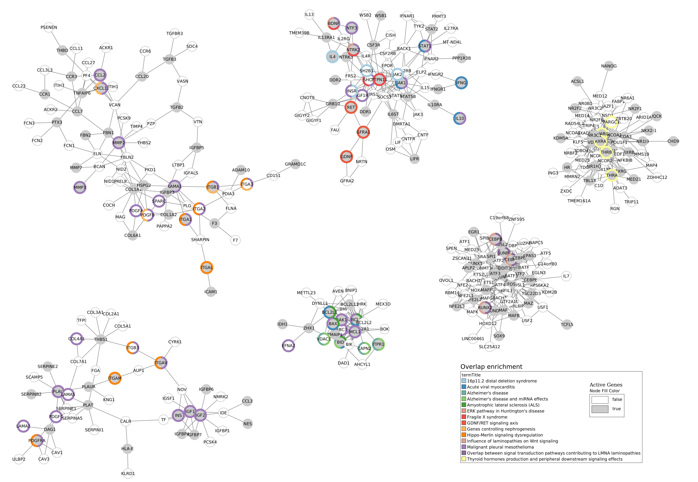
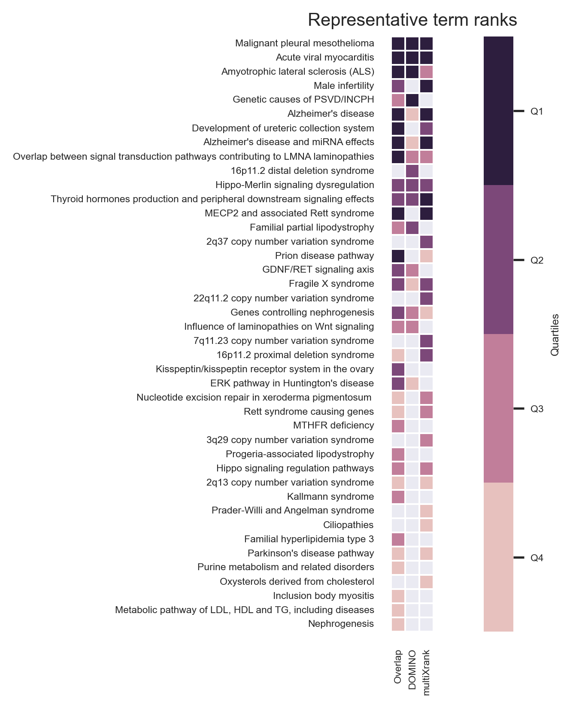

.. _usecase1:

============================================================
Use-case 1: data are extracted automatically with requests
============================================================

.. note::

    This analysis is inspired by the study carried out by Ozisik *et al.,* [1]_.

We want to study the molecular relationship between chemicals (hormones, vitamins etc.) and rare diseases.

**Target genes**, that are targeted by the chemicals of interest, are extracted **directly** from the |ctd|_ [2]_ (CTD).
**Rare disease pathways** are extracted from **WikiPathways** [3]_ website_.
We choose to use as chemical of interest, the **vitamin A**n

This section presents you how to apply the three different approaches proposed.

.. _ctd: http://ctdbase.org/
.. |ctd| replace:: **the Comparative Toxicogenomics Database**
.. _website: https://www.wikipathways.org/

.. _useCase1_overlap:

Overlap analysis
=====================

This approach calculates the overlap between genes targeted by vitamin A, and rare disease pathways
(see :doc:`../approaches/methods_overlap` section for more details).

Running overlap analysis with data extracted automatically from databases
----------------------------------------------------------------------------

The **chemicalsFile.csv** file [:ref:`FORMAT <chemicalsFile>`] contains the MeSH ID of vitamin A. We want to extract genes that are targeted by vitamin A
and by its descendant molecules. So, the ``--directAssociation`` parameter is set to ``False``.
We keep only interactions which have at least two associated publications(``--nbPub 2``).
Results files are saved into ``useCases/OutputResults_useCase1/`` folder.

.. code-block:: bash

        odamnet overlap --chemicalsFile useCases/InputData/chemicalsFile.csv \
                                --directAssociation FALSE \
                                --nbPub 2 \
                                --outputPath useCases/OutputResults_useCase1/

Several files are generated:

- ``CTD_request_D014801_2022_09_07.tsv`` and ``CTD_requestFiltered_D014801_2022_09_07.tsv``:
  the first file contains **results from CTD** request and the second one contains the results filtered by the publication number.

- ``WP_RareDiseases_request_2022_09_07.gmt`` and ``WP_allPathways_request_2022_09_07.gmt``:
  the first file contains all the **human rare disease pathways** from WikiPathways request
  and the second file contains **background source file names**.

- ``Overlap_D014801_withRDWP.csv``: results of the overlap analysis between target genes and rare disease pathways.

For more details about these files, see the :doc:`../formats/Output` page.

Results of overlap analysis with data extracted automatically from databases
-------------------------------------------------------------------------------

*request on the 07th of September 2022*

CTD request results
~~~~~~~~~~~~~~~~~~~~~

We extracted genes that are targeted by **vitamin A** and by its descendant molecules. Request results are presented in the
following :ref:`Table 2 <useCase1OverlapCTD>`. The request extracts 7,765 target genes associated to 10 molecules (vitamin A + nine other descendant molecules).

.. _useCase1OverlapCTD:
.. table:: CTD request results
    :align: center

    +---------------------------------------------------+---------------------+------------------------+
    |                                                   | Number of molecules | Number of target genes |
    +===================================================+=====================+========================+
    |          Request result                           |          10         |      7,765             |
    +---------------------------------------------------+---------------------+------------------------+
    | After filtering by associated publications number |          7          |      2,143             |
    +---------------------------------------------------+---------------------+------------------------+

WikiPathways request results
~~~~~~~~~~~~~~~~~~~~~~~~~~~~~~~~

All pathways labeled as rare disease are extracted from WikiPathways. Request results are presented in the following
:ref:`Table 3 <useCase1OverlapWP>`. The request extracts 104 rare disease pathways.

.. _useCase1OverlapWP:
.. table:: WikiPathways request results
    :align: center

    +------------------------+-----------------+------------------+------------------+
    |                        | Pathways number | Min genes number | Max genes number |
    +========================+=================+==================+==================+
    | Rare Disease Pathways  |       104       |         3        |        436       |
    +------------------------+-----------------+------------------+------------------+
    | All Human WikiPathways |      1,281      |         1        |        484       |
    +------------------------+-----------------+------------------+------------------+

Overlap analysis results
~~~~~~~~~~~~~~~~~~~~~~~~~~~~~~~~

We obtained a significant overlap between the vitamin A target genes and **28 rare disease pathways** (pAdjusted <= 0.05).
The top 5 of these significant overlaps is presented in :ref:`Table 4 <useCase1OverlapTop5>`.

.. _useCase1OverlapTop5:
.. table:: Top 5 of the significant overlaps between the vitamin A target genes and rare disease pathways
    :align: center

    +------------+--------------------------------------------------+--------------+------------------+
    | PathwayIDs |                   PathwayNames                   |   pAdjusted  | IntersectionSize |
    +============+==================================================+==============+==================+
    |   WP5087   | Malignant pleural mesothelioma                   |   3.77e-24   |        146       |
    +------------+--------------------------------------------------+--------------+------------------+
    |   WP4298   | Acute viral myocarditis                          |   9.38e-16   |        45        |
    +------------+--------------------------------------------------+--------------+------------------+
    |   WP2447   | Amyotrophic lateral sclerosis (ALS)              |   1.04e-11   |        25        |
    +------------+--------------------------------------------------+--------------+------------------+
    | **WP5053** | **Development of ureteric collection system**    | **2.61e-08** |      **28**      |
    +------------+--------------------------------------------------+--------------+------------------+
    |   WP4879   | Overlap between signal transduction pathways ... |   7.80e-07   |        25        |
    +------------+--------------------------------------------------+--------------+------------------+

%MT% - Changer ici voir pdf anais
Ozisik *et al.,* [1]_ identified four pathways, related to CAKUT disease. All of them are significantly overlapped by vitamin A
target genes. We retrieve one of them in the top 5 (**WP5053**). Two others are significantly overlapped in our analysis
(:ref:`Table 5 <useCase1OverlapCAKUT>`):

.. _useCase1OverlapCAKUT:
.. table:: CAKUT pathways overlap results
    :align: center

    +------------+-----------------------------------------------+--------------+------------------+
    | PathwayIDs |                  PathwayNames                 |   pAdjusted  | IntersectionSize |
    +============+===============================================+==============+==================+
    | **WP5053** | **Development of ureteric collection system** | **2.61e-08** |      **28**      |
    +------------+-----------------------------------------------+--------------+------------------+
    | **WP4830** | **GDNF/RET signaling axis**                   | **1.99e-05** |      **13**      |
    +------------+-----------------------------------------------+--------------+------------------+
    | **WP4823** | **Genes controlling nephrogenesis**           | **8.72e-05** |      **18**      |
    +------------+-----------------------------------------------+--------------+------------------+
    |   WP5052   | Nephrogenesis                                 |     0.09     |         6        |
    +------------+-----------------------------------------------+--------------+------------------+

The WP5052 pathway is not significant anymore (compare to Ozisik *et al.,* [1]_ results) because the number of genes between
target genes and pathways is smaller. It affects the p-value calculation and decreases bellow our 0.05 threshold.

.. _useCase1_AMI:

Active Modules Identification (AMI)
======================================

DOMINO identifies active modules through a protein-protein interaction (PPI) network. After that, we perform an
overlap analysis between each identified active modules and rare disease pathways from WikiPathways.
For more detail, see :doc:`../approaches/methods_AMI` section.

Running Active Module Identification with data extracted automatically from databases
-----------------------------------------------------------------------------------------

.. warning::

   :octicon:`alert;2em` Results of DOMINO cannot be reproduced when using the DOMINO's server.

We want to extract genes that are targeted by vitamin A and its descendant molecules. The **chemicalsFile.csv** file
[:ref:`FORMAT <chemicalsFile>`] contains the MeSH ID of vitamin A and we set ``--directAssociation`` parameter to ``False``.
We keep only vitamin-gene interactions with at least to associated publications (``--nbPub 2``).

We identify active modules using a protein-protein interaction (PPI) network named ``PPI_network_2016.sif`` [:ref:`FORMAT <SIF>`].

Results files are saved into ``useCases/OutputResults_useCase1/`` folder.

.. code-block:: bash

        odamnet domino  --chemicalsFile useCases/InputData/chemicalsFile.csv \
                                --directAssociation FALSE \
                                --nbPub 2 \
                                --networkFile useCases/InputData/PPI_network_2016.sif \
                                --outputPath useCases/OutputResults_useCase1/

Several files are generated:

- ``CTD_request_D014801_2022_09_07.tsv`` and ``CTD_requestFiltered_D014801_2022_09_07.tsv``:
  the first file contains **results from CTD** request and the second one contains the filtered (by publications number) results.

- ``WP_RareDiseases_request_2022_09_07.gmt`` and ``WP_allPathways_request_2022_09_07.gmt``:
  the first file contains all the **human rare disease pathways** from WikiPathways request
  and the second file contains **background source file names**.

- ``DOMINO_inputGeneList_D014801.txt``: list target genes used for the active module identification.

- ``Overlap_AM_*_D014801_withRDWP.csv``: results of the overlap analysis between target genes and rare disease pathways.
  One file per active module.

- ``DOMINO_D014801_activeModulesNetwork.txt``, ``DOMINO_D014801_overlapAMresults4Cytoscape.txt``, ``DOMINO_D014801_activeModules.txt``
  , ``DOMINO_D014801_activeModulesNetworkMetrics.txt`` and ``DOMINO_D014801_signOverlap.txt``: some statistics are
  calculated and saved into files. Theses files are useful for visualisation.

For more details about these files, see :doc:`../formats/Output` page (:ref:`requestOutput`, :ref:`overlapOutput`, :ref:`AMIOutput`)

Results of Active Module identification with data extracted automatically from databases
-------------------------------------------------------------------------------------------

*request on the 07th of September 2022*

CTD request results
~~~~~~~~~~~~~~~~~~~~~

We extracted genes that are targeted by **vitamin A** and by its descendant molecules. Request results are presented in the
following :ref:`Table 6 <useCase1AMICTD>`. The request extract 7,765 target genes associated to 10 molecules (vitamin A + nine other descendant molecules).

.. _useCase1AMICTD:
.. table:: CTD request results
    :align: center

    +---------------------------------------+---------------------+-----------------+
    |                                       | Number of molecules | Number of genes |
    +=======================================+=====================+=================+
    |          Request result               |          10         |      7,765      |
    +---------------------------------------+---------------------+-----------------+
    | After filtering by publication number |          7          |      2,143      |
    +---------------------------------------+---------------------+-----------------+

WikiPathways request results
~~~~~~~~~~~~~~~~~~~~~~~~~~~~~~~~

All pathways labeled as rare disease are extracted from WikiPathways. Request results are presented in the following
:ref:`Table 7 <useCase1AMIWP>`. The request extracts 104 rare disease pathways.

.. _useCase1AMIWP:
.. table:: WikiPathways request results
    :align: center

    +------------------------+-----------------+------------------+------------------+
    |                        | Pathways number | Min genes number | Max genes number |
    +========================+=================+==================+==================+
    | Rare Disease Pathways |       104       |         3        |        436       |
    +------------------------+-----------------+------------------+------------------+
    | All Human WikiPathways |      1,281      |         1        |        484       |
    +------------------------+-----------------+------------------+------------------+

Active Modules Identification results
~~~~~~~~~~~~~~~~~~~~~~~~~~~~~~~~~~~~~~~

Target genes are defined as **active genes** by DOMINO. We give **2,143 active genes** as input. DOMINO found
**13 active modules** (:ref:`Table 8 <useCase1AMIResults>`).

.. _useCase1AMIResults:
.. table:: Composition of active modules found by DOMINO
    :align: center

    +--------------+------------+------------+
    |              | Min number | Max number |
    +==============+============+============+
    |     Edges    |     20     |     357    |
    +--------------+------------+------------+
    |     Nodes    |     17     |     93     |
    +--------------+------------+------------+
    | Active Genes |      8     |     35     |
    +--------------+------------+------------+

*See `DOMINO_D014801_activeModulesNetworkMetrics.txt file for more details.*

Overlap analysis results
~~~~~~~~~~~~~~~~~~~~~~~~~~~~~~~~

Then, we perform an overlap analysis between active modules and rare disease pathways. We found significant overlap between **16 pathways** and
**7 active modules** (padjusted <= 0.05).

.. _useCase1AMIOverlap:
.. table:: Overlap results between active module and rare disease pathways
    :align: center

    +------------+---------------------------------------------------------------------------------+
    | termID     | termTitle                                                                       |
    +============+=================================================================================+
    | WP2059     | Alzheimer's disease and miRNA effects                                           |
    +------------+---------------------------------------------------------------------------------+
    | WP2447     | Amyotrophic lateral sclerosis (ALS)                                             |
    +------------+---------------------------------------------------------------------------------+
    | WP3853     | ERK pathway in Huntington's disease                                             |
    +------------+---------------------------------------------------------------------------------+
    | WP4298     | Acute viral myocarditis                                                         |
    +------------+---------------------------------------------------------------------------------+
    | WP4541     | Hippo-Merlin signaling dysregulation                                            |
    +------------+---------------------------------------------------------------------------------+
    | WP4549     | Fragile X syndrome                                                              |
    +------------+---------------------------------------------------------------------------------+
    | WP4746     | Thyroid hormones production and peripheral downstream signaling effects         |
    +------------+---------------------------------------------------------------------------------+
    | **WP4823** | **Genes controlling nephrogenesis**                                             |
    +------------+---------------------------------------------------------------------------------+
    | **WP4830** | **GDNF/RET signaling axis**                                                     |
    +------------+---------------------------------------------------------------------------------+
    | WP4844     | Influence of laminopathies on Wnt signaling                                     |
    +------------+---------------------------------------------------------------------------------+
    | WP4879     | Overlap between signal transduction pathways contributing to LMNA laminopathies |
    +------------+---------------------------------------------------------------------------------+
    | WP4950     | 16p11.2 distal deletion syndrome                                                |
    +------------+---------------------------------------------------------------------------------+
    | WP5087     | Malignant pleural mesothelioma                                                  |
    +------------+---------------------------------------------------------------------------------+
    | WP5102     | Familial partial lipodystrophy                                                  |
    +------------+---------------------------------------------------------------------------------+
    | WP5124     | Alzheimer's disease                                                             |
    +------------+---------------------------------------------------------------------------------+
    | WP5269     | Genetic causes of PSVD/INCPH                                                    |
    +------------+---------------------------------------------------------------------------------+

**Two pathways** related to CAKUT disease are found with this approach (in bold in the :ref:`Table 9 <useCase1AMIResults>`).

Visualisation of active module identification results
~~~~~~~~~~~~~~~~~~~~~~~~~~~~~~~~

It could be interesting to visualise the active modules found and add on them the overlap results. To do that, we used
a network representation (:numref:`dominoUsage1Fig`). To know how to create this figure, see the :ref:`networkAMI` section.

.. _dominoUsage1Fig:

   : Network visualisation of the 7 active modules

Some active modules are enriched with the same pathways whereas other contain genes involved in different pathways.
In the :numref:`dominoUsage1Fig`, target genes are represented by grey nodes and others genes by white nodes.

.. _useCase1_RWR:

Random Walk with Restart (RWR)
=================================

The third approach, Random Walk with Restart (RWR), is applied into two different networks compositions:

1. Multilayer network with three molecular layers + rare disease pathways network connected to nodes
2. Multilayer network with three molecular layers + disease-disease similarity network linked with a bipartite

The RWR is performed using multiXrank.

*For more details about RWR and multiXrank, see* :doc:`../approaches/methods_RWR`.

Running Random Walk analysis with data extracted automatically from databases
--------------------------------------------------------------------------------

| To know how to create the rare disease pathways network: see :ref:`pathwaysOfInterestNet`.
| To know how to create the disease-disease similarity network: see :ref:`DDnet`.

Whatever the network used, we want to extract target genes of vitamin A and its descendant molecules (``--directAssociation False``).
The **chemicalsFile.csv** file [:ref:`FORMAT <chemicalsFile>`] contains the MeSH ID of vitamin A.
Then, we keep vitamin-gene interaction with at least 2 associated publications (``--nbPub 2``).

MultiXrank needs a configuration file (``--configPath``) and the networks path (``--networksPath``). We run the analysis with
default parameters.

The target genes are set as seeds for the walk and saved into a file ``--seedsFile examples/InputData/seeds.txt``.
You need to give the SIF name (``--sifFileName``) to save the top nodes based on the score calculated by the RWR (``--top 10``).

Results files are saved into ``useCases/OutputResults_useCase1/`` folder.

If you need more details about the input format files, see :ref:`GR` and :ref:`configFile` parts.

.. tip::

    Whatever the networks used, the **command line is the same**. But you have to **change** the network name inside the
    **configuration file**.

    .. tabs::

        .. group-tab:: Rare disease pathways network

            .. code-block:: bash
                :emphasize-lines: 9,11

                 multiplex:
                     1:
                         layers:
                             - multiplex/1/Complexes_Nov2020.gr
                             - multiplex/1/PPI_Jan2021.gr
                             - multiplex/1/Reactome_Nov2020.gr
                     2:
                         layers:
                             - multiplex/2/WP_RareDiseasesNetwork_fromRequest.sif
                 bipartite:
                     bipartite/Bipartite_WP_RareDiseases_geneSymbols_fromRequest.tsv:
                         source: 2
                         target: 1
                 seed:
                     seeds.txt

        .. group-tab:: Disease-Disease similarity network

            .. code-block:: bash
               :emphasize-lines: 9,11

                multiplex:
                    1:
                        layers:
                            - multiplex/1/Complexes_Nov2020.gr
                            - multiplex/1/PPI_Jan2021.gr
                            - multiplex/1/Reactome_Nov2020.gr
                    2:
                        layers:
                            - multiplex/2/DiseaseSimilarity_network_2022_06_11.txt
                bipartite:
                    bipartite/Bipartite_genes_to_OMIM_2022_09_27.txt:
                        source: 2
                        target: 1
                seed:
                    seeds.txt

.. code-block:: bash

    odamnet multixrank  --chemicalsFile useCases/InputData/chemicalsFile.csv \
                                --directAssociation FALSE \
                                --nbPub 2 \
                                --configPath useCases/InputData/config_minimal_useCase1.yml \
                                --networksPath useCases/InputData/ \
                                --seedsFile useCases/InputData/seeds.txt \
                                --sifFileName resultsNetwork_useCase1.sif \
                                --top 10 \
                                --outputPath useCases/OutputResults_useCase1/

Several files are generated:

- ``CTD_request_D014801_2022_09_07.tsv`` and ``CTD_requestFiltered_D014801_2022_09_07.tsv``:
  the first file contains **results from CTD** request and the second one contains the filtered (by publications number) results.

- ``RWR_D014801/`` folder with the walk results:

    - ``config_minimal_useCase1.yml`` and ``seeds.txt``: copies of the input files

    - ``multiplex_1.tsv`` and ``multiplex_2.tsv``: score for each feature. 1 corresponds to the multiplex and 2 to
      the rare disease pathways network (depends of the network folder name).

    - ``resultsNetwork_useCase1.sif``: SIF file that contains the network result

For more details about these file, see :doc:`../formats/Output` page.

Results of Random Walk analysis with data extracted automatically from databases
-----------------------------------------------------------------------------------

*request on the 07th of September 2022*

CTD request results
~~~~~~~~~~~~~~~~~~~~~~~~

We extracted genes that are targeted by **vitamin A** and by its descendant molecules. Request results are presented in the
following :ref:`Table 10 <useCase1RWRCTD>`. The request extract 7,765 target genes associated to 10 molecules (vitamin A + nine others descendant molecules).

.. _useCase1RWRCTD:
.. table:: CTD request results
    :align: center

    +----------------------------------+---------------------+-----------------+
    |                                  | Number of molecules | Number of genes |
    +==================================+=====================+=================+
    |          Request result          |          10         |      7,765      |
    +----------------------------------+---------------------+-----------------+
    | After filtering by papers number |          7          |      2,143      |
    +----------------------------------+---------------------+-----------------+

Random Walk with Restart results
~~~~~~~~~~~~~~~~~~~~~~~~~~~~~~~~~~~~

We use the default parameters, whatever the networks used.

Rare disease pathways network analysis
""""""""""""""""""""""""""""""""""""""""""

*In this part, we present results found for the first multilayer network composition: multilayer network + rare disease pathways.*

First, target genes are used as seed to start the walk: ``1,988/2,143`` genes are used.

The gene with the highest score is ``VCAM1`` with ``score = 0.0002083975629882177`` (it's a seed). This score helps
us to select a list of pathways. All pathways with a score bigger than this score are extracted and considered as connected
with target genes (i.e. seeds).

According this highest score, **27 pathways** are selected (:ref:`Table 11 <useCase1_pathwaysRWR>`).

.. _useCase1_pathwaysRWR:
.. table:: Pathways linked to target genes
    :align: center

    +------------+-----------------------------------------------------+--------------+
    | node       | pathways                                            | score        |
    +============+=====================================================+==============+
    | WP5087     | Malignant pleural mesothelioma                      | 0.002871     |
    +------------+-----------------------------------------------------+--------------+
    | WP4673     | Male infertility                                    | 0.000868     |
    +------------+-----------------------------------------------------+--------------+
    | WP5124     | Alzheimer's disease                                 | 0.000775     |
    +------------+-----------------------------------------------------+--------------+
    | WP2059     | Alzheimer's disease and miRNA effects               | 0.000775     |
    +------------+-----------------------------------------------------+--------------+
    | WP4298     | Acute viral myocarditis                             | 0.000731     |
    +------------+-----------------------------------------------------+--------------+
    | WP4746     | Thyroid hormones production and peripheral ...      | 0.000622     |
    +------------+-----------------------------------------------------+--------------+
    | WP3584     | MECP2 and associated Rett syndrome                  | 0.000601     |
    +------------+-----------------------------------------------------+--------------+
    | WP5224     | 2q37 copy number variation syndrome                 | 0.000567     |
    +------------+-----------------------------------------------------+--------------+
    | WP4549     | Fragile X syndrome                                  | 0.000555     |
    +------------+-----------------------------------------------------+--------------+
    | WP4657     | 22q11.2 copy number variation syndrome              | 0.000522     |
    +------------+-----------------------------------------------------+--------------+
    | WP4541     | Hippo-Merlin signaling dysregulation                | 0.000521     |
    +------------+-----------------------------------------------------+--------------+
    | WP4932     | 7q11.23 copy number variation syndrome              | 0.000492     |
    +------------+-----------------------------------------------------+--------------+
    | **WP5053** | **Development of ureteric collection system**       | **0.000454** |
    +------------+-----------------------------------------------------+--------------+
    | WP4949     | 16p11.2 proximal deletion syndrome                  | 0.000442     |
    +------------+-----------------------------------------------------+--------------+
    | WP5114     | Nucleotide excision repair in xeroderma pigmentosum | 0.000394     |
    +------------+-----------------------------------------------------+--------------+
    | WP4312     | Rett syndrome causing genes                         | 0.000393     |
    +------------+-----------------------------------------------------+--------------+
    | WP2447     | Amyotrophic lateral sclerosis (ALS)                 | 0.000384     |
    +------------+-----------------------------------------------------+--------------+
    | WP4879     | Overlap between signal transduction pathways ...    | 0.000328     |
    +------------+-----------------------------------------------------+--------------+
    | WP4906     | 3q29 copy number variation syndrome                 | 0.000305     |
    +------------+-----------------------------------------------------+--------------+
    | WP4540     | Hippo signaling regulation pathways                 | 0.000303     |
    +------------+-----------------------------------------------------+--------------+
    | WP5222     | 2q13 copy number variation syndrome                 | 0.000284     |
    +------------+-----------------------------------------------------+--------------+
    | WP3995     | Prion disease pathway                               | 0.000280     |
    +------------+-----------------------------------------------------+--------------+
    | WP3998     | Prader-Willi and Angelman syndrome                  | 0.000247     |
    +------------+-----------------------------------------------------+--------------+
    | WP4803     | Ciliopathies                                        | 0.000244     |
    +------------+-----------------------------------------------------+--------------+
    | WP2371     | Parkinson's disease pathway                         | 0.000231     |
    +------------+-----------------------------------------------------+--------------+
    | **WP4823** | **Genes controlling nephrogenesis**                 | **0.000221** |
    +------------+-----------------------------------------------------+--------------+
    | WP4545     | Oxysterols derived from cholesterol                 | 0.000214     |
    +------------+-----------------------------------------------------+--------------+

Two pathways related to CAKUT disease are found: WP5053 and WP4823. You can visualise the results with a network as
shown on the :numref:`useCase1_orsum`.

.. _useCase1_pathwaysNetworkRWR:
.. figure:: ../../pictures/RWR_pathwaysNet_useCase1.png
   :alt: usecase 1 pathwaysNetworkRWR
   :align: center

   : Results from RWR through the molecular multilayer and rare disease pathways network

    Disease pathways are represented by triangle nodes in pink, genes are represented by white nodes and target genes by grey nodes.

Disease-Disease similarity network
"""""""""""""""""""""""""""""""""""""

*In this part, we present results found for the second multiplex composition: multiplex + disease-disease network.*

First, target genes are used as seed to start the walk: ``1,988/2,143`` genes are used.

We selected the top 10 of diseases (:ref:`Table 12 <useCase1_diseasesRWR>`).

.. _useCase1_diseasesRWR:
.. table:: Diseases linked to target genes
    :align: center

    +-------------+-----------------------------------------+----------+
    | node        | Disease name                            | score    |
    +=============+=========================================+==========+
    | OMIM:601626 | Leukemia, acute myeloid                 | 0.000161 |
    +-------------+-----------------------------------------+----------+
    | OMIM:125853 | Diabetes mellitus, noninsulin-dependent | 0.000155 |
    +-------------+-----------------------------------------+----------+
    | OMIM:114500 | Colorectal cancer                       | 0.000153 |
    +-------------+-----------------------------------------+----------+
    | OMIM:211980 | Lung cancer, susceptibility to          | 0.000117 |
    +-------------+-----------------------------------------+----------+
    | OMIM:600807 | Asthma, susceptibility to               | 0.000103 |
    +-------------+-----------------------------------------+----------+
    | OMIM:114480 | Breast cancer                           | 0.000087 |
    +-------------+-----------------------------------------+----------+
    | OMIM:601665 | OBESITY                                 | 0.000067 |
    +-------------+-----------------------------------------+----------+
    | OMIM:114550 | Hepatocellular carcinoma                | 0.000066 |
    +-------------+-----------------------------------------+----------+
    | OMIM:613659 | Gastric cancer, somatic                 | 0.000064 |
    +-------------+-----------------------------------------+----------+
    | OMIM:180300 | Rheumatoid arthritis                    | 0.000064 |
    +-------------+-----------------------------------------+----------+

You can represent the results with a network as shown in the :numref:`useCase1_simNetworkRWR`.

.. _useCase1_simNetworkRWR:
.. figure:: ../../pictures/RWR_pathwaysNet_useCase1_simNet.png
   :alt: usecase 1 simNetworkRWR
   :align: center

   : Results from RWR through the molecular multiplex and disease-disease similarity network

    Diseases are represented by triangle pink nodes, genes are represented by white nodes and target genes by grey nodes.

Results comparison
======================

We compare results obtained with the three different approaches (overlap, active modules identification and random walk
with restart), using orsum [4]_.
Results are displayed into a heatmap in the :numref:`useCase1_orsum`.

.. code-block:: bash

    orsum.py    --gmt 00_Data/WP_RareDiseases_request_2022_09_07.gmt \
                --files Overlap_D014801_withRDWP.4Orsum DOMINO_D014801_signOverlap.4Orsum diseasesResults.4Orsum \
                --fileAliases Overlap DOMINO multiXrank \
                --outputFolder useCase1Comparison/

.. _useCase1_orsum:

   : Comparison of use-case 1 results using orsum

References
============
.. [1] Ozisik, O., Ehrhart, F., Evelo, C. T., Mantovani, A., & Baudot, A. (2021). Overlap of vitamin A and vitamin D target genes with CAKUT-related processes. F1000Research, 10.
.. [2] Davis AP, Grondin CJ, Johnson RJ, Sciaky D, Wiegers J, Wiegers TC, Mattingly CJ The Comparative Toxicogenomics Database: update 2021. Nucleic Acids Res. 2021.
.. [3] Martens, M., Ammar, A., Riutta, A., Waagmeester, A., Slenter, D. N., Hanspers, K., ... & Kutmon, M. (2021). WikiPathways: connecting communities. Nucleic acids research, 49(D1), D613-D621.
.. [4] Ozisik, O., Térézol, M., & Baudot, A. (2022). orsum: a Python package for filtering and comparing enrichment analyses using a simple principle. BMC bioinformatics, 23(1), 1-12.