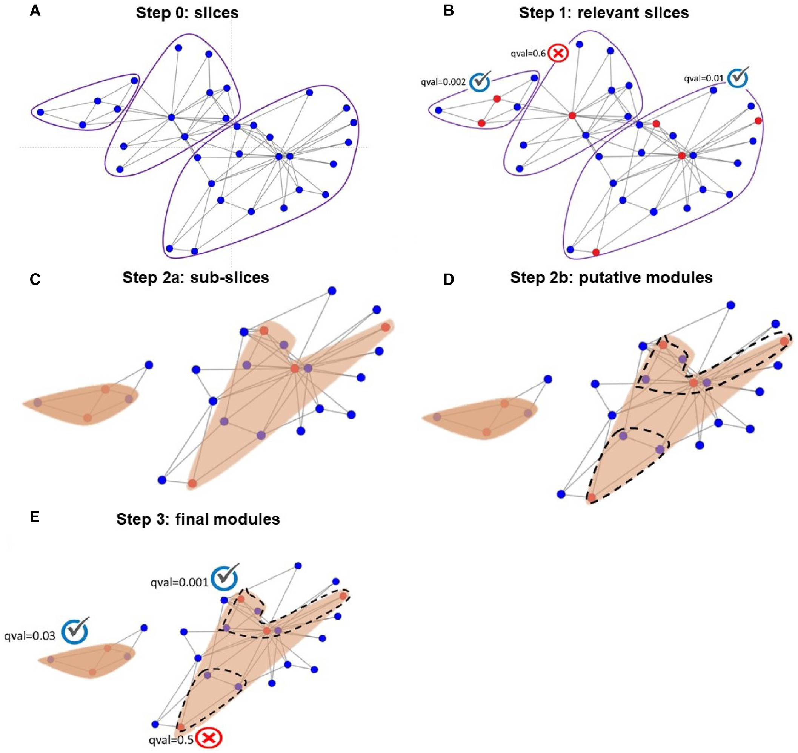
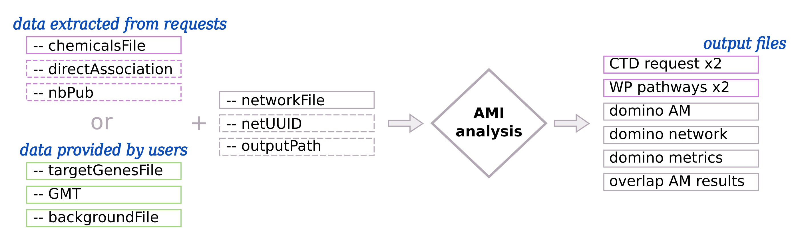

.. _AMI:

==================================================
Active Module Identification
==================================================

Principle
------------

.. note::

    | Active Modules (AM) identification is performed using DOMINO [1]_. The analysis is running on the domino server [2]_.
    | :octicon:`mark-github;1em` `DOMINO web GitHub <https://github.com/Shamir-Lab/domino_web>`_ -- :octicon:`globe;1em` `DOMINO server <http://domino.cs.tau.ac.il/>`_

DOMINO is looking for **Active Modules** (AM) in a network (e.g. Protein-Protein Interaction (PPI) network) (:numref:`overviewFig` - middle part).

First, DOMINO defines target genes as **Active Genes**. From them, DOMINO tries to **identify active modules** through a network.

Active modules are **subnetworks** identified as relevant and composed of active genes (i.e. target genes) and other associated genes.
Ideally, they will represent **functional modules** and can thereby reveal biological processes involved in a specific condition.

Finally, we performed an **overlap analysis** between each AM identified by DOMINO and pathways of interest.

Overview of the DOMINO algorithm
-----------------------------------

The :numref:`dominoMethodFig` is an overview of the DOMINO algorithm.

.. _dominoMethodFig:

    : Schematic illustration of DOMINO (Fig3 from DOMINO's paper [1]_)

| **A - Step 0:** The network is clustered into disjoint and highly connected subnetworks (slices) with the Louvain algorithm, based on modularity optimization.
| **B - Step 1:** The relevant slices (where active genes are over-represented) are detected using the Hypergeometric test. Pvalue are corrected with the FDR method.
| **C - Step 2a:** The most active sub-slice is identified on each relevant slices.
| **D - Step 2b:** The sub-slices are split into putative Active Modules (AM) using the Newmann-Girvan modularity algorithm.
| **E - Step 3:** The final set of AM is identified (under a threshold of Bonferroni qval<=0.05).

*For more details, see to the DOMINO's publication* [1]_.

Usage
-------

By default, data are extracted directly by requesting databases (:numref:`dominoUsageFig`: section *data extracted from requests*).
You give the ``--chemicalsFile`` and the **target genes** are extracted from **CTD**. **Rare Disease pathways** are
extracted from **WP** automatically too. You can give some optional parameters to custom the selection of target genes.

You can provide your own **target genes file** and **pathways/processes of interest**
(:numref:`dominoUsageFig`: section *data provided by users*) with ``--targetGenesFile`` and ``--GMT``, ``--backgroundFile``.

.. _dominoUsageFig:

    : Input and output files/parameters of Active Modules Identification

    There are two ways to extract target genes : from request (pink boxes) or provided by users (green boxes).
    Required files/parameters have solid border line and optional files/parameters have dash border line.
    Output files in pink are created only if the input data are extracted from requests.

Input parameters for the Active Modules Identification
--------------------------------------------------------

| To extract target genes from **CTD** and RD pathways from **WP**, see parameters on the ``Data extracted from requests`` tab.
| To provide **your own** target genes and pathways/processes files, see parameters on the ``Data provided by users`` tab.

The network file is required ``--networkFile`` whereas ``--netUUID`` and ``--outputPath`` are optional.

.. tabs::

    .. group-tab:: Data extracted from requests

        -c, --chemicalsFile FILENAME
            Contains a list of chemicals. They have to be in **MeSH** identifiers (e.g. D014801).
            You can give several chemicals in the same line : they will be grouped for the analysis.
            [:ref:`FORMAT <chemicalsFile>`] **[required]**

        --directAssociation BOOLEAN
            | ``TRUE``: extract chemicals data, which are in the chemicalsFile, from CTD
            | ``FALSE``: extract chemicals and their child molecules data from CTD
            | ``[default: True]``

        --nbPub INTEGER
            Publications can be associated with chemical interactions.
            You can define a minimum number of publications to keep target genes.
            ``[default: 2]``

    .. group-tab:: Data provided by users

        -t, --targetGenesFile FILENAME
            Contains a list of target genes. One gene per line. [:ref:`FORMAT <targetGenesFile>`]
            **[required]**

        --GMT FILENAME
            Tab-delimited file that describes gene sets of pathways/processes of interest.
            Pathways/processes can come from several sources (e.g. WP and GO\:BP).
            [:ref:`FORMAT <pathways>`]
            **[required]**

        --backgroundFile FILENAME
            List of the different background source file name. Each background genes source is a GMT file.
            It should be in the same order than the GMT file.
            [:ref:`FORMAT <pathways>`]
            **[required]**

-n, --networkFile FILENAME
    Network file name. It's SIF file [:ref:`FORMAT <SIF>`] **[required]**

--netUUID TEXT
    You can use a network extracted automatically from `NDEx <https://www.ndexbio.org/#/>`_ [3]_. You have to provide
    the UUID of the network (e.g. ``079f4c66-3b77-11ec-b3be-0ac135e8bacf``).

-o, --outputPath PATH
    Name of the folder to save results.
    ``[default: OutputResults]``

Networks available
-----------------------------------

.. warning::

    Be careful when using networks from NDEx: gene IDs format are not always consistent between the networks and data from
    CTD or other input gene lists and pathways.
    CTD returns gene symbols (i.e. HGNC), so the network need to contains gene symbols and not ensembl IDs or any other
    gene name format. The same constraint exists for GMT files.

Protein-Protein Interaction (PPI) network
^^^^^^^^^^^^^^^^^^^^^^^^^^^^^^^^^^^^^^^^^^^

We provide a PPI network (from the Valdeolivas *et al.,* paper [4]_, November 2016). The gene name format is
**gene symbols**. You can give it to the script using the required parameter ``-n, --networkFile``.

It contains 66 971 interactions (edges) and 12 621 genes (nodes). The following part gives you an overview of the file:

.. code-block::

    node_1	link	node_2
    AAMP	ppi	VPS52
    AAMP	ppi	BHLHE40
    AAMP	ppi	AEN
    AAMP	ppi	C8orf33
    AAMP	ppi	TK1

User-provided network
^^^^^^^^^^^^^^^^^^^^^^^^^^

.. caution::

    :octicon:`alert;2em;sd-text-info` gene IDs need to correspond with the target genes list and GMT files !!

You can use any network that you want or have. It has to be in :ref:`SIF format <SIF>` and you can give it to
the script using the required parameter ``-n, --networkFile``.

Networks from NDEx database
^^^^^^^^^^^^^^^^^^^^^^^^^^^^^^^^^^^^

.. caution::

    :octicon:`alert;2em;sd-text-info` gene IDs need to correspond with the target genes list and GMT files !!

You can directly request NDEx [3]_ `website <https://www.ndexbio.org/>`_ and extract the network that you want to use
(REST API [3]_:sup:`,` [5]_ :sup:`,` [6]_). You need to specify the network UUID using the optional parameter
``--netUUID``. The network will be save into a :ref:`SIF file <SIF>`.

Use-cases command lines
-------------------------

.. tabs::

    .. group-tab:: Data extracted from requests

        .. code-block:: bash

            odamnet domino  --chemicalsFile useCases/InputData/chemicalsFile.csv \
                                    --directAssociation FALSE \
                                    --nbPub 2 \
                                    --networkFile useCases/InputData/PPI_network_2016.sif \
                                    --outputPath useCases/OutputResults_useCase1/

    .. group-tab:: Data provided by users

        .. code-block:: bash

            odamnet domino  --targetGenesFile useCases/InputData/VitA-Balmer2002-Genes.txt \
                                    --GMT useCases/InputData/PathwaysOfInterest.gmt \
                                    --backgroundFile useCases/InputData/PathwaysOfInterestBackground.txt \
                                    --networkFile useCases/InputData/PPI_network_2016.sif \
                                    --outputPath useCases/OutputResults_useCase2/

References
------------

.. [1] Levi, H., Elkon, R., & Shamir, R. (2021). DOMINO: a network‐based active module identification algorithm with reduced rate of false calls. Molecular systems biology, 17(1), e9593.
.. [2] Levi, H., Rahmanian, N., Elkon, R., & Shamir, R. (2022). The DOMINO web-server for active module identification analysis. Bioinformatics, 38(8), 2364-2366.
.. [3] Pratt et al. NDEx, the Network Data Exchange. Cell Systems, Vol. 1, Issue 4: 302-305 (2015).
.. [4] Valdeolivas, A., Tichit, L., Navarro, C., Perrin, S., Odelin, G., Levy, N., ... & Baudot, A. (2019). Random walk with restart on multiplex and heterogeneous biological networks. Bioinformatics, 35(3), 497-505.
.. [5] Pillich et al. NDEx: A Community Resource for Sharing and Publishing of Biological Networks. Methods Mol Biol, 1558: 271-301 (2017).
.. [6] Pratt et al. NDEx 2.0: A Clearinghouse for Research on Cancer Pathways. Cancer Res. Nov 1;77(21):e58-e61 (2017).
