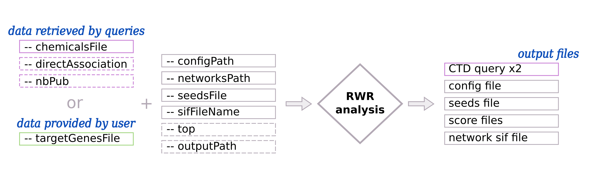

.. _RWR:

==================================================
Random Walk with Restart
==================================================

Principle
------------

.. note::

    The Random Walk with Restart is performed using multiXrank [1]_ --
    :octicon:`mark-github;1em` `GitHub <https://github.com/anthbapt/multixrank>`_ :octicon:`book;1em` `ReadTheDocs <https://multixrank-doc.readthedocs.io/en/latest/>`_

The Random Walk with Restart (RWR) approach measures the **proximity** between chemical target genes and all the nodes
(e.g. genes, diseases ...) that are present in a multilayer network. All target genes are considered as **seeds** to
start a walk. The proximity is represented by a RWR score, used to prioritize rare disease pathways. Higher score means
smaller distance and better connexion with chemical target genes.

RWR is a **diffusion analysis** from chemical target genes using a multilayer network composed of different genes
interaction networks and rare disease pathways network (:numref:`overviewFig` - right part).

*For more details, see the multiXrank's paper* [1]_.

Usage
-------

By default, data are directly retrieved from databases using queries (:numref:`RWRUsageFig`: section *data retrieved*
*by queries*). **Chemical target genes** are retrieved from the |ctd|_ [2]_ (CTD) using ``--chemicalsFile`` parameter.

You can provide your own **target genes** (:numref:`RWRUsageFig`: section *data provided by user*) using
``--targetGenesFile``.

The ``--configPath``, ``--networksPath``, ``--seedsFile``, and ``--sifFileName`` are required and provide multilayer
network data. To create or download multiplayer network, see :doc:`../network/NetworkUsed` page.

The ``--top`` and ``--outputPath`` parameters are optional.

.. _RWRUsageFig:

    : Input and output of Random Walk with Restart (RWR)

    (Left part) - By default, chemical target genes are retrieved using automatic queries. The user can also provide
    their own data. Required input are represented with pink and green solid border line boxes whereas optional inputs
    are represented with dashed border line boxes.
    (Right part) - Output files in pink are created only if the input data are retrieved by queries.

Input parameters for the RWR
------------------------------

.. warning::

    - Gene IDs have to be **consistent** between input data *(target genes, GMT and networks)*
    - When data are retrieved by queries, **HGNC** IDs are used.

| To use data **retrieved from databases**, see parameters on the ``Data retrieved by queries`` tab.
| To provide **your own** data, see parameters on the ``Data provided by user`` tab.

.. tabs::

    .. group-tab:: Data retrieved by queries

        -c, --chemicalsFile FILENAME
            Contains a list of chemicals. They have to be in **MeSH** identifiers (e.g. D014801).
            Each line contains one or several chemical IDs, separated by ";".
            [:ref:`FORMAT <chemicalsFile>`] **[required]**

        --directAssociation BOOLEAN
            | ``TRUE``: retrieve genes targeted by chemicals, from CTD
            | ``FALSE``: retrieve genes targeted by chemicals and theirs descendant chemicals, from CTD
            | ``[default: True]``

        --nbPub INTEGER
            Each interaction between target gene and chemical can be associated with publications.
            You can filter these interactions according the number of associated publications.
            You can define a minimum number of publications to keep an association.
            ``[default: 2]``

    .. group-tab:: Data provided by user

        -t, --targetGenesFile FILENAME
            Contains a list of target genes. One target gene per line. [:ref:`FORMAT <targetGenesFile>`]
            **[required]**

--configPath PATH
    multiXrank needs a configuration file. This file can be short (with only file names) or very detailed (with file
    names + parameters). It contains at least paths of networks, bipartite and seed files. **[required]**

    | For more details : :ref:`Config file format <configFile>` - :octicon:`mark-github;1em` `GitHub <https://github.com/anthbapt/multixrank>`_ :octicon:`book;1em` `ReadTheDocs <https://multixrank-doc.readthedocs.io/en/latest/>`_

--networksPath PATH
    Folder path where networks are saved. **[required]**

--seedsFile FILENAME
    Path name file to store seed list. This file contains the target genes list. The given path needs to be the same
    given in the configuration file. **[required]**

--sifFileName FILENAME
    Output file name to save the result into a SIF file format. **[required]**

--top INTEGER
    Top nodes that will be saved into the output files.

-o, --outputPath PATH
    Folder name to save results.
    ``[default: OutputResults]``

Use-cases command lines
-------------------------

Examples of command lines with ``Data retrieved by queries`` and ``Data provided by user``.

.. tabs::

    .. group-tab:: Data retrieved by queries

        .. code-block:: bash

            odamnet multixrank      --chemicalsFile useCases/InputData/chemicalsFiles.csv \
                                    --directAssociation FALSE \
                                    --nbPub 2 \
                                    --configPath useCases/InputData/config_minimal_useCase1_sim.yml \
                                    --networksPath useCases/InputData/ \
                                    --seedsFile useCases/InputData/seeds.txt \
                                    --sifFileName UseCase1_RWR_network_sim.sif \
                                    --top 20 \
                                    --outputPath useCases/OutputResults_useCase1

    .. group-tab:: Data provided by user

        .. code-block:: bash

            odamnet multixrank      --targetGenesFile useCases/InputData/VitA-Balmer2002-Genes.txt \
                                    --configPath useCases/InputData/config_minimal_useCase2.yml \
                                    --networksPath useCases/InputData/ \
                                    --seedsFile useCases/InputData/seeds.txt \
                                    --sifFileName UseCase2_RWR_network.sif \
                                    --top 20 \
                                    --outputPath useCases/OutputResults_useCase2

References
------------

.. [1] Baptista A, Gonzalez A & Baudot A. Universal multilayer network exploration by random walk with restart. Communications Physics. 2022.
.. [2] Davis AP, Grondin CJ, Johnson RJ *et al.*. The Comparative Toxicogenomics Database: update 2021. Nucleic acids research. 2021.

.. _ctd: http://ctdbase.org/
.. |ctd| replace:: Comparative Toxicogenomics Database