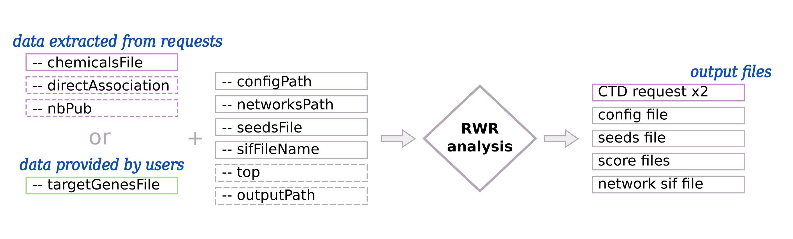

.. _RWR:

==================================================
Random Walk with Restart
==================================================

Principle
------------

.. note::

    The Random Walk with Restart is performed using multiXrank [1]_ --
    :octicon:`mark-github;1em` `GitHub <https://github.com/anthbapt/multixrank>`_ :octicon:`book;1em` `ReadTheDocs <https://multixrank-doc.readthedocs.io/en/latest/>`_

The Random Walk with Restart (RWR) approach measures the **proximity** between target genes and all the nodes (e.g. genes,
diseases ...) that are present in a multilayer network. All target genes are considered as **seeds** to start a walk. The proximity
is represented by a score that can be use for multiple analysis. Higher score corrsponds to smaller distance and better connection between the node and the seeds.

RWR is a **diffusion analysis** from the genes through different molecular interactions (:numref:`overviewFig` - right part).

*For more details, see the multiXrank's paper* [1]_.

Usage
-------

By default, data are extracted directly by querying databases (:numref:`RWRUsageFig`: *data extracted from requests*).
You give the ``--chemicalsFile`` and the **target genes** are extracted from the **Comparative Toxicogenomics Database** (CTD).

You can provide your own **target genes file** (:numref:`RWRUsageFig`: section *data provided by users*) with ``--targetGenesFile``.

.. _RWRUsageFig:

    : Input and output files/parameters of Random Walk with Restart analysis

    There are two ways to extract target genes: from automatic request (pink boxes) or from the files provided by the user (green boxes).
    Required files/parameters have solid border line and optional files/parameters have dashed border line.
    Output files in pink are created only if the input data are extracted from requests.

Input parameters for the RWR analysis
----------------------------------------

| To extract target genes from **CTD**, see parameters on the ``Data extracted from requests`` tab.
| To provide **your own** target genes, see parameters on the ``Data provided by users`` tab.

.. tabs::

    .. group-tab:: Data extracted from requests

        -c, --chemicalsFile FILENAME
            Contains a list of chemicals. They have to be in **MeSH** identifiers (e.g. D014801).
            Each line contains one or several chemical IDs, separated by ";".
            [:ref:`FORMAT <chemicalsFile>`] **[required]**

        --directAssociation BOOLEAN
            | ``TRUE``: extract chemicals data, which are in the chemicalsFile, from CTD
            | ``FALSE``: extract chemicals and their child molecules data from CTD
            | ``[default: True]``

        --nbPub INTEGER
            Each interaction between target gene and chemical can be associated with publications.
            You can filter these interactions according the number of publication associated.
            You can define a minimum number of publications.
            ``[default: 2]``

    .. group-tab:: Data provided by users

        -t, --targetGenesFile FILENAME
            Contains a list of target genes. One gene per line. [:ref:`FORMAT <targetGenesFile>`]
            **[required]**

--configPath PATH
    MultiXrank needs a configuration file. It can be short (with only file names) or very detailed (with file names + parameters).
    The file contains at least paths of networks, bipartite and seed files. **[required]**

    | For more details : [:ref:`FORMAT <configFile>`] - :octicon:`mark-github;1em` `GitHub <https://github.com/anthbapt/multixrank>`_ :octicon:`book;1em` `ReadTheDocs <https://multixrank-doc.readthedocs.io/en/latest/>`_

--networksPath PATH
    Repository path where networks are saved. **[required]**

--seedsFile FILENAME
    Path name file to store seed list. This file contains the target genes list. They will be used as seed
    on the Random Walk analysis. **[required]**

--sifFileName FILENAME
    Output file name to save the result into a SIF file. **[required]**

--top INTEGER
    Top nodes that will be saved into the output network (into SIF file).

-o, --outputPath PATH
    Name of the folder to save the results.
    ``[default: OutputResults]``

Use-cases command lines
-------------------------

.. tabs::

    .. group-tab:: Data extracted from requests

        .. code-block:: bash

            odamnet multixrank  --chemicalsFile useCases/InputData/chemicalsFile.csv \
                                        --directAssociation FALSE \
                                        --nbPub 2 \
                                        --configPath useCases/InputData/config_minimal_useCase1.yml \
                                        --networksPath useCases/InputData/ \
                                        --seedsFile useCases/InputData/seeds.txt \
                                        --sifFileName resultsNetwork_useCase1.sif \
                                        --top 10 \
                                        --outputPath useCases/OutputResults_useCase1/

    .. group-tab:: Data provided by users

        .. code-block:: bash

            odamnet multixrank  --targetGenesFile useCases/InputData/VitA-Balmer2002-Genes.txt \
                                        --configPath useCases/InputData/config_minimal_useCase2.yml \
                                        --networksPath useCases/InputData/ \
                                        --seedsFile useCases/InputData/seeds.txt \
                                        --sifFileName resultsNetwork_useCase2.sif \
                                        --top 10 --outputPath \
                                        --outputPath useCases/OutputResults_useCase2/

Networks available
--------------------

.. note::

    We use the multilayer network from multiXrank's paper [1]_.

We propose to run the RWR on two different multilayer networks:

- multilayer network with three molecular layers + pathways/processes of interest network (:numref:`RWRFig` - left part)
- multilayer network with three molecular layers + disease-disease similarity network (:numref:`RWRFig` - right part)

.. _RWRFig:
.. figure:: ../../pictures/NetworkAvailable_RWR.png
    :alt: RWR networks
    :align: center

    : Random Walk with Restart into two different network compositions

*multiXrank need network as input. So we create the pathways/processes of interest network, even if it's a disconnected*
*network (without link between nodes).*

Molecular multilayer
~~~~~~~~~~~~~~~~~~~~~~~~~~~~~~~~~~

Protein-Protein Interaction (PPI) network
""""""""""""""""""""""""""""""""""""""""""""

The Protein-Protein Interaction (PPI) network is obtained from fusion of three datasets : APID, Hi-Union and Lit-BM. It's composed of:

- 14,703 nodes

- 143,653 edges

Molecular complexes network
"""""""""""""""""""""""""""""""

Molecular complexes network is constructed from the fusion of Hu.map and Corum using OmniPathR. It's composed of:

- 8,537 nodes

- 63,561 edges

Reactome pathway network
""""""""""""""""""""""""""""

This network is extracted from NDEx and corresponds to the Human Reactome data. It's composed of:

- 7,926 nodes

- 194,500 edges

.. _pathwaysOfInterestNet:

Pathways/processes of interest network
~~~~~~~~~~~~~~~~~~~~~~~~~~~~~~~~~~~~~~~~

This kind of network can be build using the ``networkCreation`` method.

By default, the network is build using rare disease pathways extracted automatically from WikiPathways.

--networksPath PATH
    Output repository name where the pathways/processes network will be saved.

--bipartitePath PATH
    Output repository name where the bipartite gene-pathway will be saved.

--networksName FILENAME
    You can give a name to the pathway network. It's a SIF file but each pathway/processes of interest is link to itself.
    ``[default: WP_RareDiseasesNetwork.sif]``

--bipartiteName FILENAME
    You can give a name to the bipartite. It's a tab-separated file.
    ``[default: Bipartite_WP_RareDiseases_geneSymbols.tsv]``

-o, --outputPath PATH
    Name of the folder to save complementary results (i.e. request results)
    ``[default: OutputResults]``

Moreover, you can provide your own pathways/processes of interest file using ``--GMT`` parameter.

.. tabs::

    .. group-tab:: Data extracted from requests

        .. code-block:: bash

            odamnet networkCreation --networksPath useCases/InputData/multiplex/2/ \
                                            --networksName WP_RareDiseasesNetwork_fromRequest.sif \
                                            --bipartitePath useCases/InputData/bipartite/ \
                                            --bipartiteName Bipartite_WP_RareDiseases_geneSymbols_fromRequest.tsv \
                                            --outputPath useCases/OutputResults_useCase1
    .. group-tab:: Data provided by users

        .. code-block:: bash

            odamnet networkCreation --networksPath useCases/InputData/multiplex/2/ \
                                            --networksName pathwaysOfInterestNetwork_fromPaper.sif \
                                            --bipartitePath useCases/InputData/bipartite/ \
                                            --bipartiteName Bipartite_pathOfInterest_geneSymbols_fromPaper.tsv \
                                            --GMT useCases/InputData/PathwaysOfInterest.gmt \
                                            --outputPath useCases/OutputResults_useCase2

.. _DDnet:

Disease-disease similarity network
~~~~~~~~~~~~~~~~~~~~~~~~~~~~~~~~~~~~

Disease-disease similarity network creation
""""""""""""""""""""""""""""""""""""""""""""""

| *Data was download on the 2022/06/11.*
| *Annotations* (|annot|_) *and ontologies* (|onto|_) *are coming from HPO.*

.. _annot: https://hpo.jax.org/app/data/annotation
.. |annot| replace:: *website*
.. _onto: https://hpo.jax.org/app/data/ontology
.. |onto| replace:: *website*

We constructed a disease-disease network based on the phenotype similarity between diseases. A disease is defined as
a set of phenotypes and each phenotype is associated to the Human Ontology Project IDs (HPO).

The similarity score is calculated based on the number of shared phenotypes between two diseases ([3]_, [2]_, [1]_).
Every pairs of diseases will have a similarity score. For each disease we selected the 5 most similar diseases to
create the network.

The **disease-disease** network contains 33,925 edges and 8,264 diseases.

.. tip::

    | You can use any network and multilayer network as input.
    | :octicon:`alert;1em` Be careful with the configuration file and the gene IDs used.

Gene-disease bipartite
""""""""""""""""""""""""

| *Data was download on the 2022/09/27.*
| *Association between genes and diseases file is coming from HPO* (|assos|_)

.. _assos: https://hpo.jax.org/app/data/annotation
.. |assos| replace:: *website*

The **molecular multilayer network** is connected to the **disease-disease similarity network** with the **gene-disease bipartite**.
The bipartite contains 6,564 associations (4,483 genes and 5,878 diseases).

References
------------

.. [1] Baptista, A., Gonzalez, A., & Baudot, A. (2022). Universal multilayer network exploration by random walk with restart. Communications Physics, 5(1), 1-9.
.. [2] Valdeolivas, A., Tichit, L., Navarro, C., Perrin, S., Odelin, G., Levy, N., ... & Baudot, A. (2019). Random walk with restart on multiplex and heterogeneous biological networks. Bioinformatics, 35(3), 497-505.
.. [3] Westbury SK, Turro E, Greene D, et al. Human phenotype ontology annotation and cluster analysis to unravel genetic defects in 707 cases with unexplained bleeding and platelet disorders. Genome Med. 2015;7(1):36. Published 2015 Apr 9. doi:10.1186/s13073-015-0151-5
