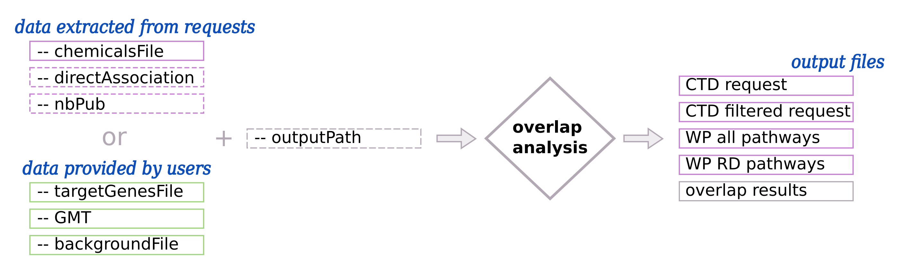

.. _overlap:

==================================================
Overlap analysis
==================================================

Principle
------------

The overlap analysis calculates the **overlap** between **target genes** and **pathways/processes of interest**.
In other words, it looks for target genes that are part of pathways/processes, i.e. **direct overlap**
(:numref:`overviewFig` - left part). This approach is presented in Ozisik *et al.,* [1]_ for a
specific use case.

First, an **overlap** between target genes and all the pathways/processes is computed. Then, a **statistical significance**
is calculated using an **hypergeometric test**. Finally, a **Benjamini-Hochberg** (BH adjusted) correction is applied
to correct the pvalues.

Usage
-------

By default, the data are directly extracted by requests on databases (:numref:`overlapFig`: section *data extracted from requests*).
The users give the ``--chemicalsFile`` and the **target genes** are extracted from the **Comparative Toxicogenomics Database** (CTD).
The users can also provide optional parameters to customize the selection of target genes.

All **rare disease pathways** are extracted from **WikiPathways** automatically.

In addition, the users can provide their own **target genes** and **pathways/processes of interest**.
(:numref:`overlapFig`: section *data extracted from users*) with ``--targetGenesFile`` and ``--GMT``, ``--backgroundFile``.

.. _overlapFig:

    : Input and output of overlap analysis

    (Left part) - Target genes and rare disease pathways can be extracted using automatic request.
    Required input are represented with pink solid border line boxes. The users can also provide their own data.
    Required input are represented with green solid border line boxes.
    Optional input are represented with dash border line boxes.
    (Right part) - Output files that are in pink are created only if the input data are extracted from request.

Input parameters for the overlap analysis
-------------------------------------------

| To extract target genes from **CTD** and rare disease pathways from **WikiPathways**, see parameters on the ``Data extracted from requests`` tab.
| To provide **your own** target genes and pathways/processes files, see parameters on the ``Data provided by users`` tab.

The ``--outputPath`` parameter is used for both data extraction.

.. tabs::

    .. group-tab:: Data extracted from requests

        -c, --chemicalsFile FILENAME
            Contains a list of chemicals. They have to be in **MeSH** identifiers (e.g. D014801).
            Each line contains one or several chemical IDs, separated by ";".
            [:ref:`FORMAT <chemicalsFile>`] **[required]**

        --directAssociation BOOLEAN
            | ``TRUE``: extract chemicals data, which are in the chemicalsFile, from CTD
            | ``FALSE``: extract chemicals and their child molecules data from CTD
            | ``[default: True]``

        --nbPub INTEGER
            Each interaction between target gene and chemical can be associated with publications.
            You can filter these interactions according the number of publication associated.
            You can define a minimum number of publications.
            ``[default: 2]``

    .. group-tab:: Data provided by users

        -t, --targetGenesFile FILENAME
            Contains a list of target genes. One gene per line. [:ref:`FORMAT <targetGenesFile>`]
            **[required]**

        --GMT FILENAME
            Tab-delimited file that describes gene sets of pathways/processes of interest.
            Pathways/processes can come from several sources (e.g. WP and GO\:BP).
            [:ref:`FORMAT <pathways>`]
            **[required]**

        --backgroundFile FILENAME
            List of the different background source file name. Each background genes source is a GMT file.
            It should be in the same order than the GMT file.
            [:ref:`FORMAT <pathways>`]
            **[required]**

-o, --outputPath PATH
    Name of the folder to save results.
    ``[default: OutputResults]``

Use-cases command lines
-------------------------

.. tabs::

    .. group-tab:: Data extracted from requests

        .. code-block:: bash

            odamnet overlap --chemicalsFile useCases/InputData/chemicalsFile.csv \
                                    --directAssociation FALSE \
                                    --nbPub 2 \
                                    --outputPath useCases/OutputResults_useCase1/

    .. group-tab:: Data provided by users

        .. code-block:: bash

            odamnet overlap --targetGenesFile useCases/InputData/VitA-Balmer2002-Genes.txt \
                                    --GMT useCases/InputData/PathwaysOfInterest.gmt \
                                    --backgroundFile useCases/InputData/PathwaysOfInterestBackground.txt \
                                    --outputPath useCases/OutputResults_useCase2/

References
------------

.. [1] Ozisik, O., Ehrhart, F., Evelo, C. T., Mantovani, A., & Baudot, A. (2021). Overlap of vitamin A and vitamin D target genes with CAKUT-related processes. F1000Research, 10:395.
