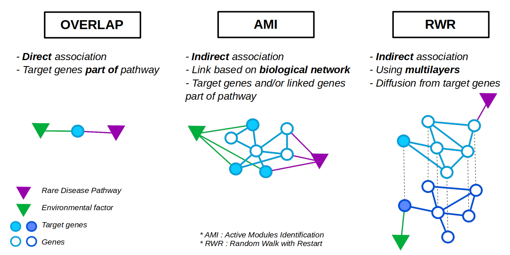

==================================================
Overview of the approaches
==================================================

Goal
======

Our goal is to uncover the **relationships between chemicals** (e.g. vitamins, hormones etc ...) and **Rare Diseases**.
To this end, we extract data **directly from databases** and implement **different approaches**.

Data are extracted **automatically** from the **Comparative Toxicogenomics Database** (CTD) [1]_ for target genes and
**WikiPathways** (WP) [2]_ for Rare Disease pathways (see :ref:`usecase1`).

We propose three different approaches to study the relationships between genes which are targeted by chemicals and Rare
Diseases (:numref:`overviewFig`):

    - :ref:`overlap`
    - :ref:`AMI`
    - :ref:`RWR`

Theses three approaches are **complementary** and perform **network exploration** at different level of interactions.

.. _overviewFig:

    : Overview of the three implemented approaches

Moreover, the approaches are open to **external input files** provided by yourself (e.g. target genes file instead of
chemicals file, pathways and/or processes etc ...). Take a look at :ref:`usecase2`, if you want to use your own input files.

References
==============

.. [1] Davis AP, Grondin CJ, Johnson RJ, Sciaky D, Wiegers J, Wiegers TC, Mattingly CJ The Comparative Toxicogenomics Database: update 2021. Nucleic Acids Res. 2021.
.. [2] Martens, M., Ammar, A., Riutta, A., Waagmeester, A., Slenter, D. N., Hanspers, K., ... & Kutmon, M. (2021). WikiPathways: connecting communities. Nucleic acids research, 49(D1), D613-D621.