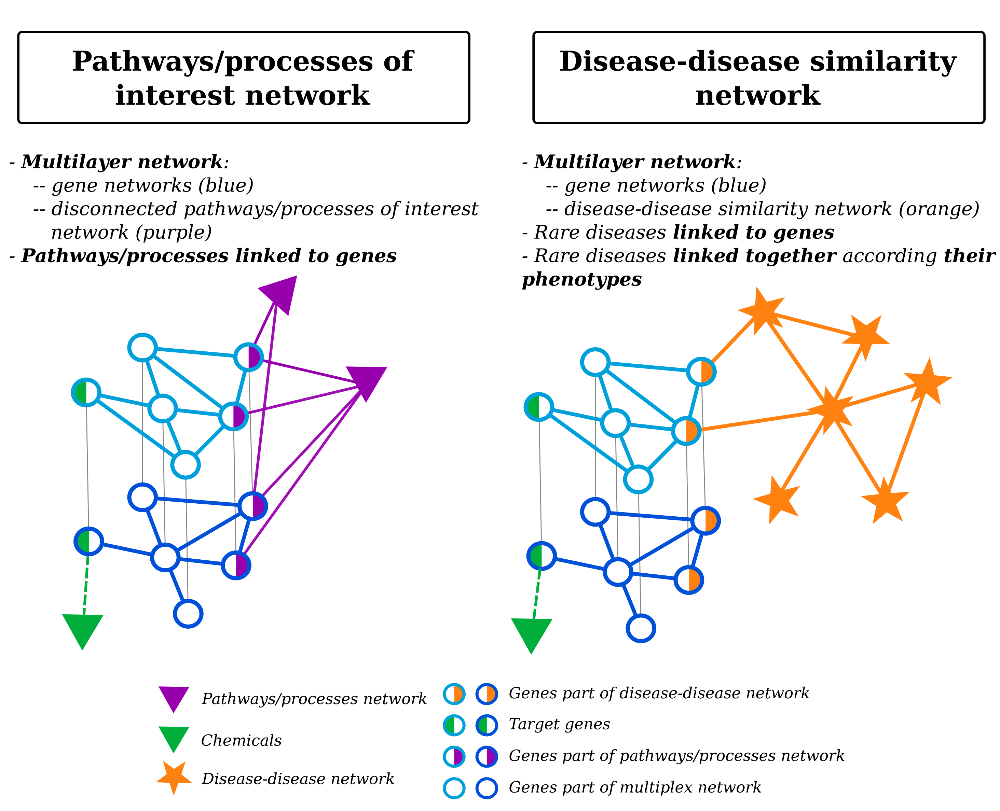

================================
Networks used
================================

.. warning::

    - Gene IDs have to be **consistent** between input data *(target genes, GMT and networks)*
    - When data are retrieved by queries, **HGNC** IDs are used.

In this section, we present networks used in the use-cases.

We propose to apply the random walk with restart (RWR) approach on two different multilayers.

.. _multilayerCompo:

    : Multilayers composition: On the left, multilayer is composed of genes multilayer network and pathways/processes
    of interest network (disconnected network). On the right, the multilayer is composed of genes multiplayer network
    and disease-disease similarity network.

Multilayers are composed of:

- genes multilayer network + pathways/processes of interest network (:numref:`multilayerCompo` - left part)

- genes multilayer network + disease-disease similarity network (:numref:`multilayerCompo` - right part)

.. _genesMultilayerNet:

Genes multilayer network
===========================

The genes multilayer network is composed of three different networks. Nodes are identical between networks, but the
relationships between them are coming from different sources. Networks are downloaded from the |NDEx|_ (NDEx) [1]_
(see :doc:`../network/NetworkDownloading` page).

.. _PPInet:

Protein-Protein Interaction (PPI) network
-------------------------------------------

The Protein-Protein Interaction (PPI) network is obtained from fusion of three datasets : Hi-Union and Lit-BM [2]_ and
APID [3]_. It's composed of:

- 15,390 nodes

- 131,087 edges

- UUID: |netPPI|_

*This network is also used for the active module identification approach.*

Molecular complexes network
-----------------------------

Molecular complexes network is constructed from the fusion of Hu.map [4]_ and Corum [5]_. It's composed of:

- 8,497 nodes

- 62,073 edges

- UUID: |netComplex|_

Reactome pathways network
---------------------------

The Reactome pathways network was build using data derived from Reactome protein-protein interaction data [6]_.
It's composed of:

- 4,598 nodes

- 19,292 edges

- UUID: |netReactome|_

Use-case command lines
------------------------

.. tabs::

    .. group-tab:: PPI network

        .. code-block:: bash

            odamnet networkDownloading  --netUUID bfac0486-cefe-11ed-a79c-005056ae23aa \
                                        --networkFile useCases/InputData/multiplex/1/PPI_HiUnion_LitBM_APID_gene_names_190123.gr \
                                        --simple True

    .. group-tab:: Molecular complexes network

        .. code-block:: bash

            odamnet networkDownloading  --netUUID 419ae651-cf05-11ed-a79c-005056ae23aa \
                                        --networkFile useCases/InputData/multiplex/1/Complexes_gene_names_190123.gr \
                                        --simple True

    .. group-tab:: Reactome pathways network

        .. code-block:: bash

            odamnet networkDownloading  --netUUID b13e9620-cefd-11ed-a79c-005056ae23aa \
                                        --networkFile useCases/InputData/multiplex/1/Pathways_reactome_gene_names_190123.gr \
                                        --simple True

.. _pathwaysOfInterestNet:

Pathways/processes of interest network
========================================

In the use-case 1, we are using **data retrieved from databases**. So, we created a rare disease pathways network with
data retrieved from WikiPathways [7]_. The network is composed of 104 nodes and the bipartite contains 4,612 interactions
between genes and rare disease pathways.

In the use-case 2, we are **provided data from a previous study** [8]_. We created a disconnected network with pathways
or processes related to Congenital Anomalies of the Kidney and Urinary Tract (CAKUT) as nodes. The network is composed of
13 nodes and the bipartite network contains 1,655 interactions between genes and pathways and processes related to
CAKUT.

To know how to create these two networks, see the :doc:`../network/NetworkCreation` page.

.. _similarityNet:

Disease-disease similarity network
====================================

Disease-disease similarity network creation
----------------------------------------------

| *Data were downloaded on June 11th, 2022*
| |annot|_ *and* |onto|_ *are coming from HPO*

We constructed a disease-disease network based on the phenotype similarity between diseases. A disease is defined as
a set of phenotypes and each phenotype is associated to the Human Ontology Project IDs (HPO) [9]_.

The similarity score is calculated based on the number of shared phenotypes between two diseases ([10]_, [11]_, [12]_).
Every pairs of diseases will have a similarity score. For each disease we selected the 5 most similar diseases to
create the network.

The **disease-disease** similarity network contains 33,925 edges and 8,264 diseases.

Gene-disease bipartite
-------------------------

| *Data were downloaded on September 27th, 2022*
| |assos|_ *between genes and diseases file is coming from HPO*

The **molecular multilayer network** is connected to the **disease-disease similarity network** with the
**gene-disease bipartite**. The bipartite contains 6,564 associations (4,483 genes and 5,878 diseases).

References
============

.. [1] Pratt D, Chen J, Welker *et al.*. NDEx, the Network Data Exchange. Cell Systems. 2015.
.. [2] Luck K, Kim DK, Lambourne L *et al.*. A reference map of the human binary protein interactome. Nature. 2020.
.. [3] Alonso-López D, Campos-Laborie FJ, Gutiérrez MA *et al.*. APID database: redefining protein-protein interaction experimental evidences and binary interactomes. Database (Oxford). 2019.
.. [4] Drew K, Wallingford JB, Marcotte EM. hu.MAP 2.0: integration of over 15,000 proteomic experiments builds a global compendium of human multiprotein assemblies. Molecular Systeme Biology. 2021.
.. [5] Giurgiu M, Reinhard J, Brauner B *et al.*. CORUM: the comprehensive resource of mammalian protein complexes-2019. Nucleic acids research. 2019.
.. [6] Gillespie M, Jassal B, Stephan R *et al.*. The reactome pathway knowledgebase 2022. Nucleic acids research. 2022.
.. [7] Martens M, Ammar A, Riutta A *et al.*. WikiPathways: connecting communities. Nucleic acids research. 2021.
.. [8] Ozisik O, Ehrhart F, Evelo C *et al.*. Overlap of vitamin A and vitamin D target genes with CAKUT-related processes. F1000Research. 2021.
.. [9] Köhler S, Gargano M, Matentzoglu N *et al.*. The Human Phenotype Ontology in 2021, Nucleic acids research. 2021.
.. [10] Westbury SK, Turro E, Greene D *et al.*. Human phenotype ontology annotation and cluster analysis to unravel genetic defects in 707 cases with unexplained bleeding and platelet disorders. Genome Medicine. 2015.
.. [11] Valdeolivas A, Tichit L, Navarro C *et al.*. Random walk with restart on multiplex and heterogeneous biological networks. Bioinformatics. 2019.
.. [12] Baptista A, Gonzalez A & Baudot A. Universal multilayer network exploration by random walk with restart. Communications Physics. 2022.

.. _NDEx: https://www.ndexbio.org/
.. |NDEx| replace:: Network Data Exchange
.. _netPPI: https://www.ndexbio.org/viewer/networks/bfac0486-cefe-11ed-a79c-005056ae23aa
.. |netPPI| replace:: bfac0486-cefe-11ed-a79c-005056ae23aa
.. _netComplex: https://www.ndexbio.org/viewer/networks/419ae651-cf05-11ed-a79c-005056ae23aa
.. |netComplex| replace:: 419ae651-cf05-11ed-a79c-005056ae23aa
.. _netReactome: https://www.ndexbio.org/viewer/networks/b13e9620-cefd-11ed-a79c-005056ae23aa
.. |netReactome| replace:: 	b13e9620-cefd-11ed-a79c-005056ae23aa
.. _annot: https://hpo.jax.org/app/data/annotation
.. |annot| replace:: *Annotations*
.. _onto: https://hpo.jax.org/app/data/ontology
.. |onto| replace:: *ontologies*
.. _assos: https://hpo.jax.org/app/data/annotation
.. |assos| replace:: *Associations*