================================
Network visualisation
================================

Results of active module identification (AMI) and random walk with restart (RWR) approaches can be visualised using
Cytoscape [1]_.

This page contains a guideline, step by step, to create network visualisation of results such as those presented in
this documentation.

.. _cytoscape_AMI:

Active module identification results visualisation
====================================================

.. tip::

    .. cssclass:: italic

        To run an Active Module Identification with data retrieved by queries, see :ref:`Use-case 1 <useCase1_AMI>`
        and with data provided by user, see :ref:`Use-case 2 <useCase2_AMI>`.

The :numref:`cytoscapeAMI` is an example of AMI results visualisation.

.. _cytoscapeAMI:
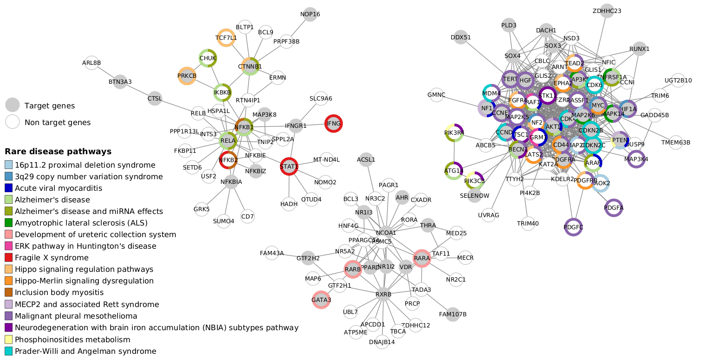

    : Use-case 1 AMI analysis visualisation (from :numref:`useCase1_AMIFig`). We use Cytoscape [1]_ to create network
    visualisation and Omics Visualizer [2]_ to add overlap results to active modules.

Step by step guidelines
---------------------------

To visualise the AMI results using network representation, use the following steps:

1. Import files
~~~~~~~~~~~~~~~~~~

.. _cytoscapeImportFile_AMI:
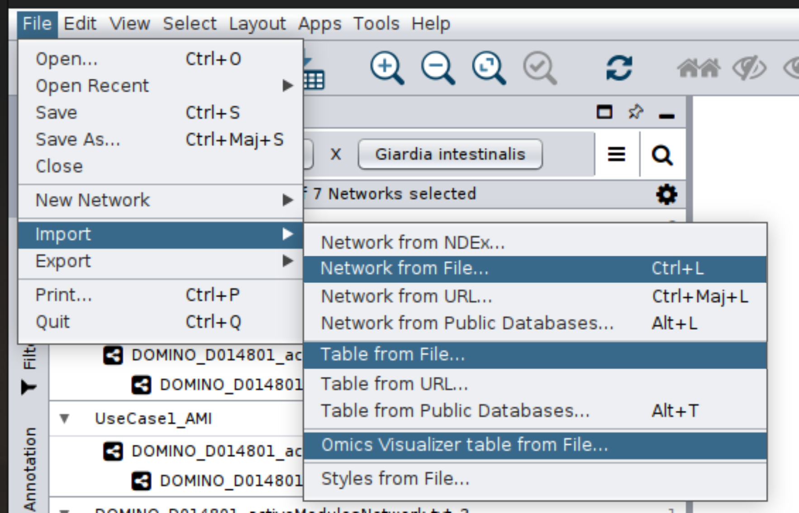

    : Step 1 - Import files

- **Import Network** from File: ``DOMINO_*_activeModulesNetwork.txt``
- **Import Table** from File: ``DOMINO_*_activeModules.txt`` (*Import Data as Node Table Columns*)

2. Add donuts
~~~~~~~~~~~~~~~~~~

.. _cytoscapeOmicsVisualizer_AMI:
.. figure:: ../../pictures/Cytoscape/Cytoscape_omicsVisualizer.png
    :alt: cytoscapeOmicsVisualizer_AMI
    :width: 600
    :align: center

    : Step 2 - Add donuts using OmicsVisualizer [2]_ app

1. **Omics Visualizer** [2]_ **table** from File: ``DOMINO_*_overlapAMresults4Cytoscape.txt``
2. Manage table **connections**: link network node table with right identifiers

    - Network: *sharedname*
    - Table: *geneSymbol*

3. **Donut Chart Visualisation**: Add overlap results using donuts (Use *termTitle*)

3. Network style
~~~~~~~~~~~~~~~~~~~

.. _cytoscapeStyle_AMI:
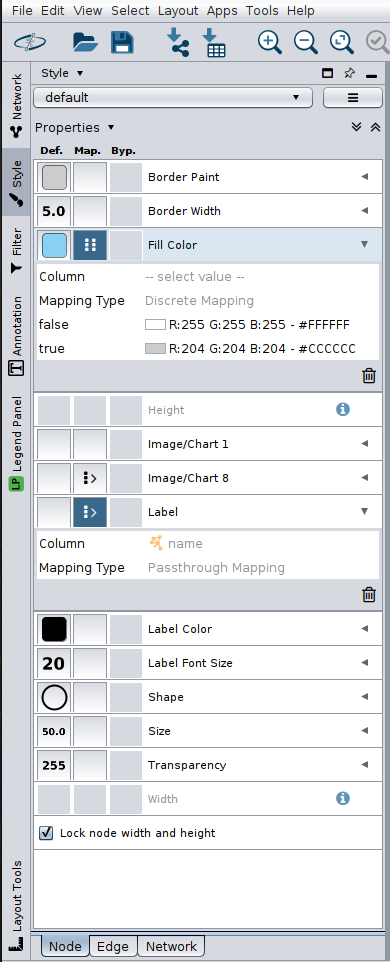

    : Step 3 - Apply style that you want

- Border Width = ``5.0``
- Fill Color = ``ActiveGenes``
    - True #CCCCCC
    - False #FFFFFF
- Label Font Size = ``20``
- Shape = ``Ellipse``
- Size = ``50``
- ``Lock node width and height``

|
|
|
|
|
|
|
|
|
|
|
|

4. Active module selection
~~~~~~~~~~~~~~~~~~~~~~~~~~~~~

.. _cytoscapeFilter_AMI:
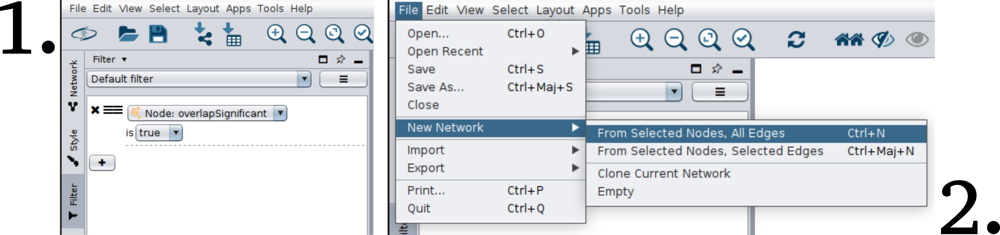

    : Step 4 - Select identified active module with a significant overlap

1. **Filter**: Select nodes with ``overlapSignificant = True``
2. **New Network**: From Selected Nodes, All Edges

.. tip::

    You can select modules that you are interested in directly (Ctrl + mouse drag) then create a new network from
    selected nodes (step 2 above).

5. Create legends
~~~~~~~~~~~~~~~~~~~~~

.. _cytoscapeLegend_AMI:
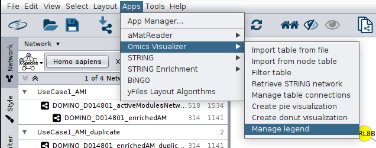

    : Step 5 - Add legend using Omics Visualizer [2]_

.. _cytoscape_RWR:

Random walk with restart results visualisation
================================================

.. tip::

    .. cssclass:: italic

        To perform a RWR with data retrieved by queries, see :ref:`Use-case 1 <useCase1_RWR>` and with data
        provided by user, see :ref:`Use-case 2 <useCase2_RWR>`.

The :numref:`cytoscapeRWR` is an example of RWR results visualisation.

.. _cytoscapeRWR:
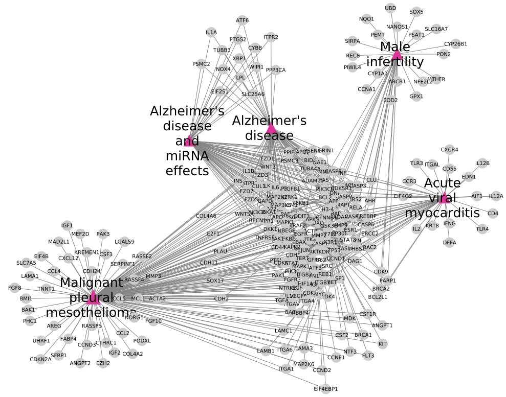

    : Use-case 1 RWR analysis visualisation (from :numref:`useCase1_RWRWPFig`). We use Cytoscape [1]_ to
    create network visualisation.

Step by step guidelines
---------------------------

To visualise the RWR results using network representation, use the following steps:

1. Import files
~~~~~~~~~~~~~~~~~~

.. _cytoscapeImportFile_RWR:
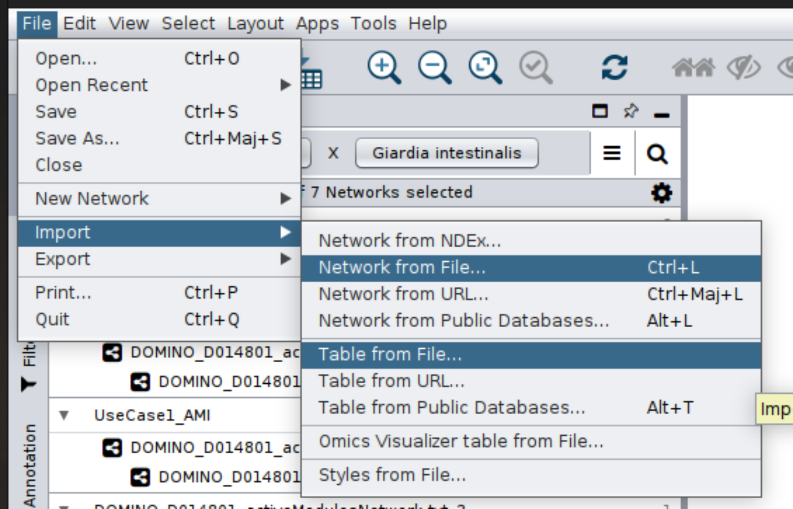

    : Step 1 - Import files

- **Import Network** from File: ``UseCase1_RWR_network.sif``
- **Import Table** from File: ``multiplex_1.tsv`` and ``multiplex_2.tsv``
- **Import Table** from File: ``seeds.4Cytoscape``

    - Change column names: ``node`` for column 1 and ``seed`` for column 2

.. tip::

   How create the **seeds.4Cytoscape** file ?

   .. code-block:: bash

        awk -F"\t" 'NR==FNR{a[$1]; next} {if($2 in a){print $2"\tTrue"}else{print $2"\tFalse"}}' seeds.txt multiplex_1.tsv > seeds.4Cytoscape

- **Import Table** from File: ``diseasesDescription.txt``

    - Change column names: ``node`` for column 1, ``pathways`` for column 2 and ``score`` for column 3

.. tip::

   How create the **diseasesDescription.txt** file ?

   .. code-block:: bash

        awk -F"\t" 'NR==FNR{a[$1]=$2; next} {if($1 in a){print $1"\t"$2"\t"a[$1]}}' RWR_top20.txt ../../OutputOverlapResults/WP_RareDiseases_request_2022_09_07.gmt > diseasesDescription.txt

2. Management of nodes table
~~~~~~~~~~~~~~~~~~~~~~~~~~~~~~

.. _cytoscapeCreateColumns_RWR:
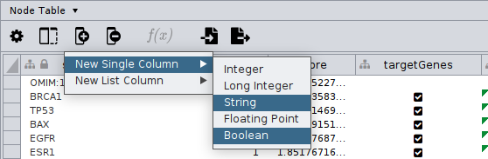

    : Step 2 - Create two new columns

- Create **two new columns** named ``label`` as *string* and ``keep`` as *boolean* in the node table

.. _cytoscapeFillNodeTable_RWR:
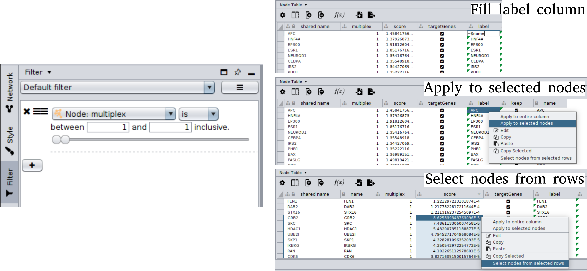

    : Step 2 - Select nodes using *Filter* and fill node table

- **Filter**: Select genes nodes (*multiplex is 1*)

    - Fill ``label`` column with ``=$name`` and apply to selected nodes
    - Fill ``keep`` column with ``=$seed`` and apply to selected nodes
    - Sort by ``score`` (decrease) and select the 30th first genes that are not a seed (selected nodes from selected rows)
    - Fill ``keep`` column with ``=True`` and apply to selected nodes

- **Filter**: Select are disease pathways nodes (*multiplex is 2*)

    - Sort by ``score`` (decrease) and select the 5th first rare disease pathways
    - Fill ``keep`` column with ``=True``
    - Fill ``label`` column with ``=$pathways`` and apply to selected nodes

3. Create new network
~~~~~~~~~~~~~~~~~~~~~~~~~~~~~~

.. _cytoscapeNewNetwork_RWR:
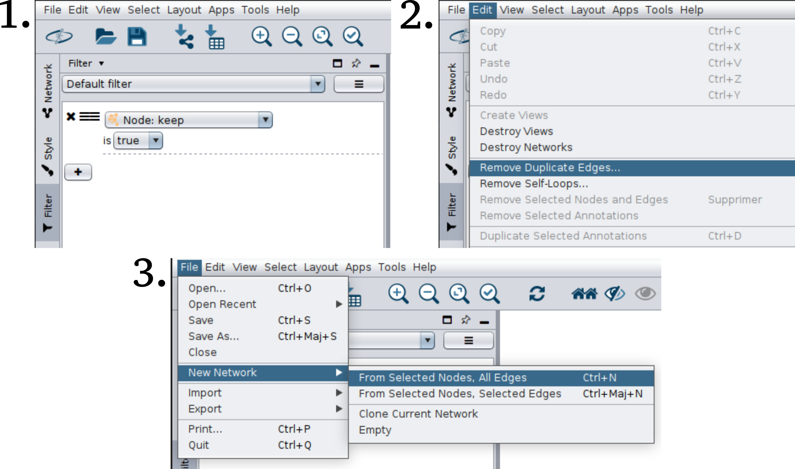

    : Step 3 - Select nodes using *Filter*, create a new network and remove duplicate edges

- **Filter**: Select nodes with ``keep = True``
- **New Network**: From Selected Nodes, All Edges
- Edit and Remove Duplicate Edges

4. Network style
~~~~~~~~~~~~~~~~~~~

.. _cytoscapeStyle_RWR:
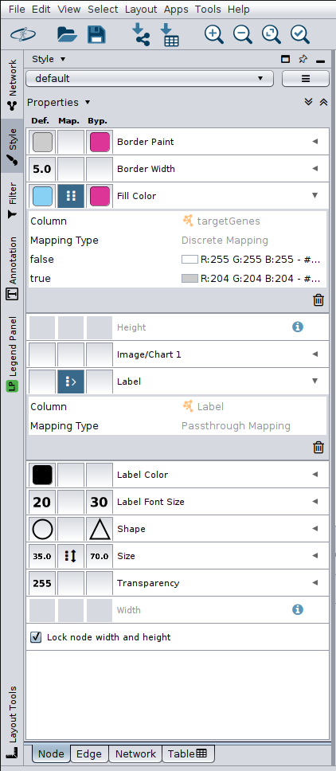

    : Step 4 - Apply style

- Change the style of nodes

.. list-table:: - Network Style
    :header-rows: 1
    :stub-columns: 1

    *   -
        - All Nodes
        - Disease Nodes
    *   - Border Width
        - 5.0
        - 5.0
    *   - Fill Color
        - | Column seed
          | True: CCCCCC
          | False: FFFFFF
        - DD3497
    *   - Label Front Size
        - 20
        - 50
    *   - Shape
        - Ellipse
        - Triangle
    *   - Lock node width & height
        - True
        - True
    *   - Size
        - 50
        - 100
    *   - Label
        - label
        - label

- Change network layout (here we used yFiles Organic Layout)

|
|
|
|

References
=============
.. [1] Shannon P, Markiel A, Ozier O *et al.*. Cytoscape: a software environment for integrated models of biomolecular interaction networks. Genome research. 2003.
.. [2] Legeay M, Doncheva NT, Morris JH  *et al.*. Visualize omics data on networks with Omics Visualizer, a Cytoscape App. F1000Research. 2020.